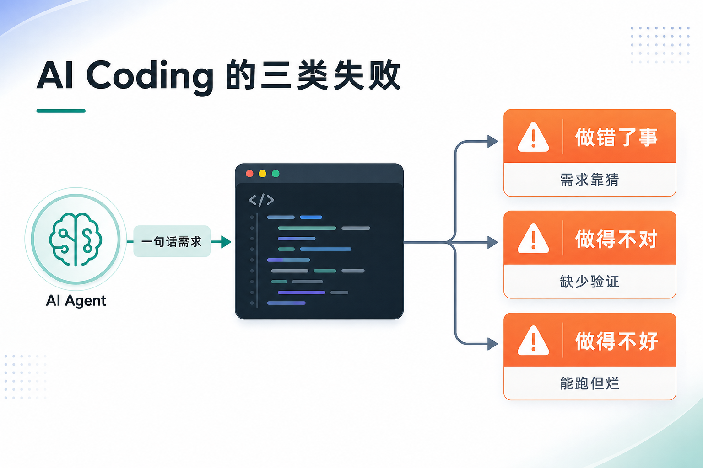
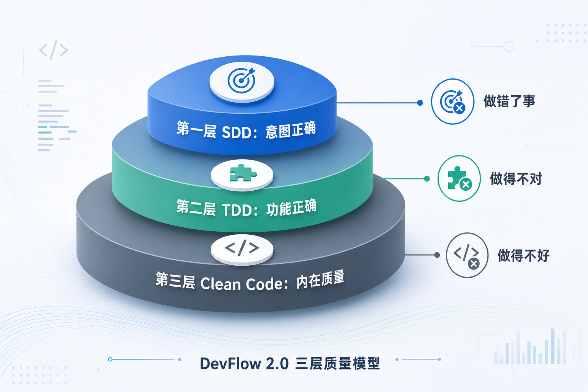
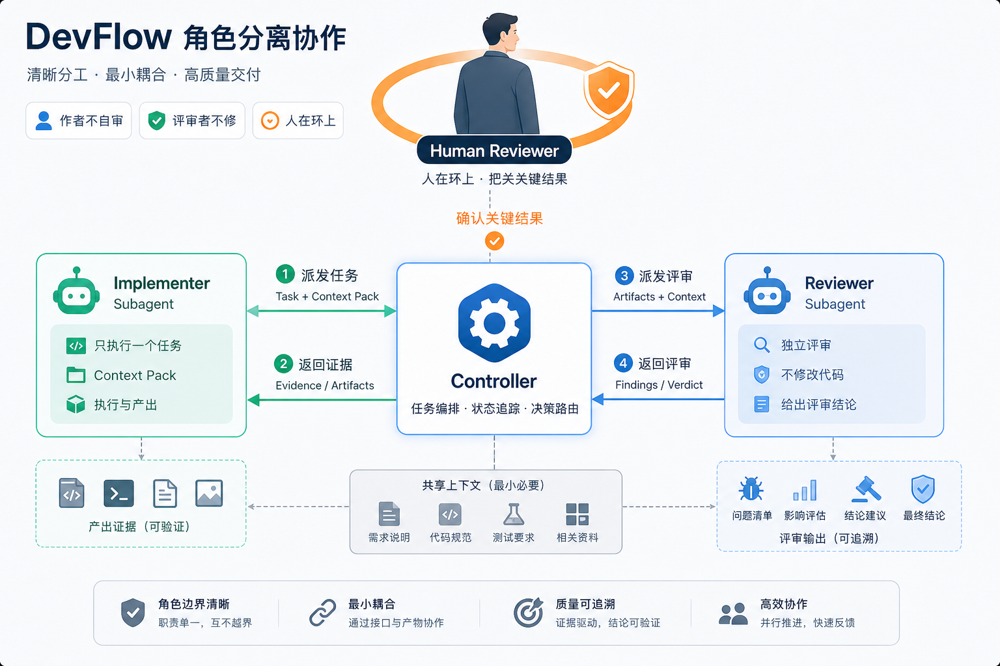

> AI Coding 已经够快了。真正麻烦的是：这些代码能不能进团队交付，能不能被人审查、接手、继续改。DevFlow 2.0 关心的不是让 AI 多写几行，而是让它写出来的东西有证据、能交接、值得长期维护。

# DevFlow 2.0：用三层质量模型驯服 AI Coding

AI Coding 用久了之后，我最大的感受不是“它不会写代码”。恰好相反，它写得太快了。

快到你刚说完一句需求，它已经开始改文件；快到你还没想清楚边界条件，它已经给出一版“完整实现”；快到你追问“测试了吗”，它立刻补几条测试，然后告诉你“已完成”。

但团队开发最怕的往往不是慢，而是不可信。AI 生成的代码如果要进入商用交付，不能只看它有没有跑起来，还要回答几个更硬的问题：

- 它做的是不是我们真正要的事？
- 它有没有被可执行、可复现的方式证明是对的？
- 它写出来的代码，半年后的人还能不能低成本读懂、审查、修改？
- 换一个会话、换一个 Agent、换一个 reviewer，还能不能从已有工件接着往下走？

DevFlow 2.0 就是在这个背景下整理出来的一套 AI coding agent 开发流程 skills。它想做的事可以压成一句话：

**在 SDD 范式下写出 Clean Code，而不是只写出能运行的代码。**

它不是给 AI Coding 加流程仪式，也不是把文档做厚。它基于一个朴素判断：AI Coding 的失败不是一类问题，而是三层问题。每一层都需要自己的质量标准、证据和人类把关点。



图 1：一句话需求直接跳到代码，通常会分叉成三类失败：做错了事、做得不对、做得不好。

## 1. AI Coding 的问题不是“不会写代码”

AI 写代码时最常见的失败，大概有三类。

第一类是**做错了事**。需求本来就含糊，模型只能猜。它会补齐没有被确认的业务规则，把“可能是这样”写成“代码就是这样”。最后东西看起来完整，但不是你真正想要的。

第二类是**做得不对**。代码没有被测试证明。它可能只跑了最理想的 happy path，也可能先写实现，再补几条永远会通过的测试。这样的测试只能说明“当前实现长这样”，不能证明“目标行为被验证过”。

第三类是**做得不好**。代码能跑，但写得烂。名字说不清意图，错误路径被吞掉，抽象是为“以后可能”预留的，测试为了方便暴露生产后门。短期看功能完成了，长期看每一次修改都会变贵，reviewer 也很难真正审进去。

这三类失败分别对应三个问题：

| 失败模式 | 表现 | 真正的问题 |
|---|---|---|
| 做错了事 | 需求含糊，模型靠猜 | 意图不正确 |
| 做得不对 | 缺少可执行验证 | 功能不正确 |
| 做得不好 | 能跑但难读难改 | 内在质量不足 |

DevFlow 2.0 的做法，是把这三类失败拆开处理。不要指望一句“请仔细一点”同时解决需求、测试和代码质量；也不要指望最后一次 code review 替前面的环节兜底。高质量代码要从外到内建起来。

## 2. DevFlow 2.0 是什么

DevFlow 2.0 是一套给 AI coding agent 用的开发流程 skills。它覆盖从“工程工作项已经被接受”到“完成评审和收尾”的这一段：需求澄清、设计、TDD 实现、独立评审、完成核验。

它不负责产品发现，不替业务负责人排优先级，也不替模块架构师拍板架构边界。DevFlow 做的是把已经决定要做的工作项，推进成一组可审查、可验证、可追溯的工程产物。

它的协作姿态是 **human-on-the-loop**：具体的活由 AI 干，人站在环上审查关键产物。

这和“人机一起写代码”的 human-in-the-loop 不一样。DevFlow 不要求人盯着 AI 每一行怎么写；它要求 AI 在关键阶段留下清楚的交接物，让人能低成本判断：规格是否清楚，设计是否成立，测试是否有效，代码是否值得长期持有。

换句话说，DevFlow 不是让人更忙，而是把人的精力留给真正需要判断的地方。

## 3. 三层质量模型：DevFlow 2.0 的核心

DevFlow 2.0 把“高质量代码”拆成三层，由外到内看，也可以理解为自上而下逐层收紧：

1. **第一层 SDD（Spec-Driven Development）**：做的是不是对的事？
2. **第二层 TDD（Test-Driven Development）**：功能被证明正确了吗？
3. **第三层 Clean Code 与软件设计**：代码本身写得好吗？

这三层不是三份互不相干的文档，而是同一份代码的三个问题。前两层看外部质量：它做的是不是对的事，功能上是不是对的。第三层看内部质量：它是否简洁、可靠、可维护、可测试，性能成本是否可接受，值不值得长期持有。



图 2：DevFlow 2.0 用三层质量模型分别对抗 AI Coding 的三类失败。

### 第一层：SDD 保证意图正确

AI Coding 最危险的捷径，是从一句模糊需求直接跳到代码。SDD 先把意图写成可测试、可评审的规格。

在 DevFlow 里，这一层由 `devflow-init` 与 `devflow-specify` 共同负责。前者为缺少基线的既有组件建立或补齐 `specs/spec.md` 与 `specs/design.md`，后者把本次工作项澄清成 `srs.md` 与 `delta-spec.md`，写清范围、需求条目、验收标准、非功能质量属性和上游锚点。

这一层的重点不是“写文档”，而是防止模型靠猜。好的 spec 要让两类读者都能读懂：下一阶段的设计/实现 Agent，以及站在环上的人类 reviewer。

如果规格还没说清楚就开始实现，本质上是在把业务风险写进代码里。

### 第二层：TDD 证明功能正确

即使需求说清楚了，代码也不能靠“看起来对”来验收。TDD 要把“正确”变成可执行、可复现的事实。

DevFlow 的 TDD 分两部分：`devflow-design` 里的测试设计，以及 `devflow-tdd` 的 RED / GREEN / REFACTOR 循环。

设计阶段先回答：要验证哪些行为？每个用例的 Given / When / Then 是什么？错误路径、边界条件、状态变化、副作用如何观察？实现阶段再按这些用例逐个推进：

- **RED**：先写一个会失败的测试，确认失败原因是目标行为缺失。
- **GREEN**：写最少实现让测试通过，并跑完整套件确认无回归。
- **REFACTOR**：在全绿基础上清理表达，保证行为不变。

没有先看着它失败的测试，就没有实现代码。这条纪律听起来严格，但它正是 AI Coding 里最容易被省略、也最能防止“补测试自欺”的部分。

### 第三层：Clean Code 保证内在质量

很多 AI 生成代码的问题不在功能，而在长期持有成本。它能跑，但下一个读者很难判断它为什么这样写；它通过测试，但错误路径很散；它抽象很多，却没有真实变化轴；它为了测试方便暴露生产后门。

DevFlow 2.0 把 Clean Code 放在第三层，不把它降级成“代码风格”。这一层由 `devflow-design`、`devflow-clean-code`、适用的 `<language>-coding-standards` 和领域技能一起负责。

`devflow-clean-code` 的判断视角只有一个：**下一个读者**。这个读者可能是评审者、半年后的维护者，也可能是下一轮接手的 AI。代码先是写给人读的，然后才是在机器上运行。

DevFlow 用五个维度检查第三层质量：

| 维度 | 代码应该呈现 | 典型风险 |
|---|---|---|
| 简洁 | 当前规格需要的最少结构 | 投机抽象、配置矩阵、单实现接口 |
| 可靠 | 错误路径和资源状态清楚 | 吞错误、漏检查可失败调用 |
| 可维护 | 名字揭示意图，职责按变化理由聚合 | 命名撒谎、上帝对象、霰弹式修改 |
| 可测试 | 逻辑可通过公共行为验证 | test-only 后门、mock 内部纯逻辑 |
| 高性能 | 算法、资源与热路径成本匹配 | 热路径 N+1、无界读取、资源泄漏 |

第三层质量是 human-on-the-loop 能成立的前提。代码如果不可审，人就只能退回到“相信 AI 自己说它做完了”。这正是 DevFlow 要避免的。

## 4. 工作流要服务质量模型

DevFlow 2.0 有流程，但主角不是流程。流程的意义，是让每个动作都对应三层质量里的一个问题。

规格阶段对应第一层：把意图写成可测试契约。

设计与 TDD 对应第二层：先把可验证行为设计出来，再用 RED / GREEN / REFACTOR 证明实现。

Clean Code、语言规范和领域技能对应第三层：让代码在正确之外，还值得长期持有。

评审和 ship 对应 human-on-the-loop：让人看到真实证据，不用相信一句“已完成”。

所以 DevFlow 不追求“节点越多越安全”，也不追求“越短越轻”。它只保留真正产生质量的部分：阶段产物、人类把关点、TDD 纪律、独立评审、收尾核验。

## 5. DevFlow 2.0 的主流程

DevFlow 2.0 的主流程可以概括为：

```text
baseline preflight -> specify -> R1 review -> design -> R2 review -> tdd -> R3 review -> ship
```

缺陷修复有一条旁路：

```text
fix -> R1/R2 review -> tdd -> R3 review -> ship
```

### baseline preflight：既有组件先有当前真相

每个工作项先创建或读取 `change.json`，确认其中的 `componentMode`。既有组件必须已经具备 baseline-ready 的 `specs/spec.md` 和 `specs/design.md`；缺任一文档就先进入 `devflow-init`，从代码、测试、接口和配置逆向建立基线。

init 坚持 **澄清而不臆造**：可验证事实写证据，业务意图与设计理由不清楚就追问，无法确认的内容保持 unknown。新增组件不走 init，由首次 delta 建立 canonical 文档。

### specify：把意图写成可测试规格

`devflow-specify` 负责写 `srs.md` 与 `delta-spec.md`，并初始化 `tasks.md` 和 `traceability.md`。它要做的不是整理需求描述，而是把模糊输入变成可评审、可测试、可追溯的增量需求和规格变化。

这个阶段完成后，不能直接进入设计。它必须经过 R1 规格评审。

### R1 review：独立评审规格

`devflow-review` 在 R1 检查规格是否可测试、是否有歧义、是否遗漏关键约束、是否把实现细节偷偷塞进需求。评审由独立上下文完成，作者不自审。

没有记录的评审等于没有评审。评审记录要落到 `reviews/`，findings 必须有 Resolution。

### design：做出值得实现的软件设计

`devflow-design` 读取当前 `specs/design.md` 与已确认的 delta spec，产出 `delta-design.md`，明确本次新增、修改、删除或重命名的职责、接口契约、错误模型、数据所有权和测试设计。

这一阶段同时影响第二层和第三层：它既要为 TDD 准备可执行的测试设计，也要给 Clean Code 留下结构、契约和边界。

### R2 review：独立评审设计

R2 检查设计是否能支撑规格，接口契约是否完整，错误模型是否清楚，测试设计是否覆盖关键行为，组件边界是否合理。

如果设计问题会导致实现阶段绕路，就要在这里修掉，别等到写代码时再“顺手调整”。

### tdd：逐用例 RED / GREEN / REFACTOR

`devflow-tdd` 按 `delta-design.md` 的测试设计细化 `tasks.md`，然后逐任务执行。每个任务都是一个薄的垂直切片，完成后应该可构建、全测试通过、证据落盘。

任务完成时，`tasks.md` 必须记录 RED / GREEN / REFACTOR 证据行。REFACTOR 不是可选收尾。即使没有清理项，也要写明已经按 `devflow-clean-code` 检查过。

### R3 review：独立评审测试与代码

R3 同时看测试和代码。测试评审看断言强度、覆盖映射、mock 边界和 RED 证据；代码评审看正确性、设计一致性、错误路径、整洁标准、语言和领域规则。

如果 R3 打回，默认回 `devflow-tdd` 定向返工。作者按 findings 修复并回写 Resolution，再发起复审。不能在评审上下文里自己修，也不能在 findings 没处理完时进入 ship。

### ship：完成核验与长期资产沉淀

`devflow-ship` 不写空泛的“本次完成总结”。它只回答两个问题：

- 这个工作项真的可以关闭吗？
- 关闭之后给仓库留下什么？

ship 阶段会对照 Definition of Done 核验证据，通读 `traceability.md` 做追溯终验。主控 Agent 阅读 SRS、delta 与 canonical 文档，智能同步 `specs/spec.md`、`specs/design.md`，由独立 reviewer 复核 Git diff；人确认后写 `closeout.md` 并把完整 AR 移到 `specs/archive/`。如果发现缺口，回对应阶段补真实证据，不补一段好看的叙述。

## 6. `change.json` 与 `tasks.md`：让新会话也能继续

AI 开发还有一个常见问题：上下文很脆。一个工作项不一定能在一次会话里完成，跨天、换人、换 Agent 都很常见。如果进度只存在聊天记录里，下一轮只能靠模型猜。

DevFlow 把状态和任务分开：`change.json` 记录组件模式、运行模式、profile、阶段门禁和工件路径；`tasks.md` 记录自包含任务、RED / GREEN / REFACTOR 证据行和返工队列。

恢复时先读 `change.json` 决定阶段，再读 `tasks.md` 决定任务断点，并用 `reviews/` 核对门禁没有漂移。一个全新会话不需要依赖聊天记忆。

这意味着任务不能写成“同上”“见聊天记录”“继续实现剩余部分”。每个任务都要自包含：

```markdown
### T3: SetModeRejectsInvalidMode

- Case ID: MODE-ERR-001
- Given: 当前模式为 SAFE
- When: 调用 mode_set(非法模式)
- Then: 返回 ERR_INVALID_ARG，当前模式不变，不发事件
- 触碰文件:
  - src/mode_service.c
  - tests/mode_service_test.cpp
- RED:
  - 写失败测试 SetModeRejectsInvalidModeWithoutStateChange
  - 运行 `ctest -R ModeServiceTest`
- GREEN:
  - 最小实现非法模式检查
  - 运行 `ctest`
- REFACTOR:
  - 检查命名、错误路径、测试断言强度
- 完成定义:
  - 新测试先红后绿
  - 完整测试套件通过
  - traceability.md 更新
```

这种“可冷读”的计划，会逼着设计、测试和实现保持一致。新 Agent 不需要读聊天历史，也能继续干活。

## 7. Subagent 用来隔离上下文

DevFlow 2.0 使用 subagent，不是为了展示“多 Agent 很高级”。它解决两个具体问题：上下文漂移和作者自审。

在 TDD 阶段，`devflow-tdd` 默认逐任务派发 `devflow-implementer`。每个 implementer 都是全新上下文，只执行一个任务。它收到的不是完整聊天历史，而是父 controller 打包的 Context Pack：任务 ID、测试设计用例、相关设计摘录、允许触碰的文件、构建/测试命令、必须加载的质量技能。

这有两个好处。

第一，它防止长会话越写越偏。implementer 不能靠聊天记忆猜，只能依赖工件。输入不足就返回 `NEEDS_CONTEXT`，不能自行补全。

第二，它反过来检验工件质量。如果一个全新上下文的实现者读不懂 `delta-design.md` 和 `tasks.md`，说明工件本身还不够可冷读。

评审阶段同理。`devflow-review` 要由独立上下文执行。reviewer 只看被评审产物、上游工件、rubric 和适用的质量技能，不看作者的推理过程。这样评审就不会变成“作者给自己找理由”，而是在检查产物能不能被别人读懂、信任。



图 5：父 controller 编排任务与证据流转，implementer 只做一个任务，reviewer 独立评审，人站在环上确认关键结果。

DevFlow 的角色分离有三条硬规则：

- 作者不自审。
- 评审者不动手修。
- 人做最终把关。

这三条规则看起来简单，但它们决定了 DevFlow 能不能从“AI 自说自话”变成“AI 生产、人审查”的协作系统。

## 8. Clean Code 要看长期持有成本

很多团队第一次引入 AI Coding 时，会把重点放在测试上。测试当然重要，但测试只能证明外部行为。它不会自动带来好名字、清楚的错误路径、合理的职责边界，也不会自动让抽象变得可维护。

DevFlow 2.0 把 Clean Code 放在第三层，是因为 human-on-the-loop 最后会落到一个很具体的问题：人到底审不审得动代码。

`devflow-clean-code` 不是独立阶段，它出现在四个地方：

- 实现期 REFACTOR：GREEN 后，在全绿基础上清理本任务触碰范围。
- R3 返工：代码评审发现 clean-code 问题后，回 TDD 阶段定向修复。
- 纯重构：用户明确要求行为不变清理时，先建立全绿基线，再小批次重构。
- 评审消费：R3 code review 或专项 clean-code review 按五个维度检查。

这里有一条关键纪律：**GREEN 帽只改变行为，REFACTOR 帽只改善表达。** 两者混在一个 diff 里，评审者就很难判断风险。

比如，测试只要求支持两个模式，GREEN 阶段却顺手引入“模式注册表 + 插件钩子 + 动态扩展点”。这不是高级设计，而是投机抽象。当前规格不需要它，测试也没有证明它，维护者却要承担它的复杂度。

Clean Code 在 DevFlow 里的目标不是漂亮，是平衡：

**通过测试、消除重复、表达设计意图、保留最少必要实体。**

所以 implementer 返回 `DONE` 时必须给出 `clean_code_check`，不能只写一句“looks clean”。它至少要覆盖简洁、可靠、可维护、可测试、高性能和范围纪律。没有第三层自检，TDD 任务就不算真正完成。

## 9. 扩展能力：语言、领域与规范生成

DevFlow 2.0 的基本想法是通用的：三层质量模型 + human-on-the-loop。但真实项目会有语言和领域差异，尤其是嵌入式、车载、C/C++ 这类场景，对资源、时序、错误路径和 ABI 都很敏感。

所以 DevFlow 把技能分成三类。

第一类是阶段技能：

| 技能 | 作用 |
|---|---|
| `using-devflow` | 入口：三层模型、工作流地图、工件约定、行为准则 |
| `devflow-init` | 为缺基线的既有组件逆向建立 canonical spec/design |
| `devflow-specify` | 把意图写成可测试 SRS 与 delta spec |
| `devflow-design` | 产出 delta design 与测试设计 |
| `devflow-tdd` | 用 RED / GREEN / REFACTOR 证明功能正确 |
| `devflow-review` | 独立评审规格、设计、测试、代码 |
| `devflow-ship` | DoD、canonical sync、closeout、archive |
| `devflow-fix` | 缺陷修复：复现、根因、最小修复边界 |

第二类是叠加技能：

| 技能 | 作用 |
|---|---|
| `devflow-clean-code` | 语言无关的整洁代码标准 |
| `devflow-clean-doc` | 面向中文的文档可读性标准，让人能冷读审查 spec 与 design |
| `c-coding-standards` | C 语言规则与惯用法 |
| `cpp-coding-standards` | C++ 规则与惯用法 |
| `embedded-development` | 嵌入式约束 |
| `automotive-development` | 车载领域约束 |

第三类是工具技能：

| 技能 | 作用 |
|---|---|
| `coding-standards-creator` | 把团队内部编码规范转化为新的 `<language>-coding-standards` 技能 |
| `devflow-learn` | 从已归档 change 中提炼一条有证据、可检索的工程经验 |

`devflow-learn` 只在 Ship 完成后按需运行。它不增加交付 gate，不修改 canonical 或 archive；捕获失败不影响已经完成的交付。语言规范按 `<language>-coding-standards` 的命名约定扩展。任何遵循结构契约的语言技能都能被设计、实现、评审和 DoD 当作叠加约束使用，不改变 DevFlow 主流程。

这就是 DevFlow 2.0 的边界：主流程保持通用，语言和领域规则按场景加载，不把所有细节塞进一条流程里。

## 10. 怎么使用 DevFlow 2.0

如果不知道从哪里开始，可以直接描述目标：

```text
用 DevFlow 开发：为通知组件增加重试机制。先把需求理清楚，不要直接写代码。
```

也可以使用 slash-style 阶段入口：

| 入口 | 适用场景 |
|---|---|
| `/devflow` | 不确定下一步，或需要从已有工件恢复进度 |
| `/devflow-init` | 既有组件缺少 canonical spec/design |
| `/devflow-specify` | 写规格 |
| `/devflow-design` | 做设计 |
| `/devflow-build` | TDD 实现 |
| `/devflow-review` | 独立评审 |
| `/devflow-fix` | 缺陷修复 |
| `/devflow-ship` | 收尾 |
| `/devflow-learn` | 从已归档 change 沉淀工程经验 |

### 普通 AR

普通 AR 通常走这条路径：

```text
specify -> R1 review -> design -> R2 review -> tdd -> R3 review -> ship
```

你给出工作项背景、目标组件和已有约束。DevFlow 先确认组件基线，再把需求澄清成 `srs.md` 与 `delta-spec.md`，评审通过后进入 delta design 和 TDD。

### 影响组件边界的 AR

如果工作项会改变组件职责、接口、状态机或依赖关系，`devflow-design` 会在 `delta-design.md` 中显式描述对当前 `specs/design.md` 的增量，归档前由 Agent 智能同步并独立复核 canonical diff。

这类工作项不要直接从代码开始。组件边界一旦靠实现阶段临时决定，后续评审只能看到结果，很难再回到真正的设计问题。

### DTS / Hotfix

缺陷修复走 `devflow-fix`：

```text
fix -> R1/R2 review -> tdd -> R3 review -> ship
```

`devflow-fix` 先做复现、根因分析和最小修复边界。修复实现仍然回到 TDD：先写能复现缺陷的失败测试，再做最小修复，最后经过 R3 测试与代码评审。

Hotfix 可以压缩文档量，但不能跳过复现、根因、测试证据、代码评审和完成核验。

## 11. DevFlow 2.0 不靠“让 AI 更听话”

很多 AI Coding 问题，看起来像是“模型不够听话”。于是我们会写更长的 prompt、更细的 checklist、更严厉的要求。

这些有用，但不够。

DevFlow 2.0 的判断是：如果质量问题本身有层次，就不能只靠一个更强的 prompt 解决。你需要让 AI 在正确的层次上工作，并且每一层都留下人能审查的证据。

SDD 让 AI 先做对的事。

TDD 让 AI 用可执行证据证明做对了。

Clean Code 与软件设计让 AI 产出的代码值得长期持有。

独立评审、`change.json`、`tasks.md`、`traceability.md`、`reviews/`、`closeout.md` 这些机制，最后都指向同一个目标：让人站在环上，以可承受的成本掌控 AI 产出。

DevFlow 的价值不在于制造更多流程，而在于让每一步留下的证据更有用，让每一份代码更值得被下一个人、下一个 Agent 接手。
