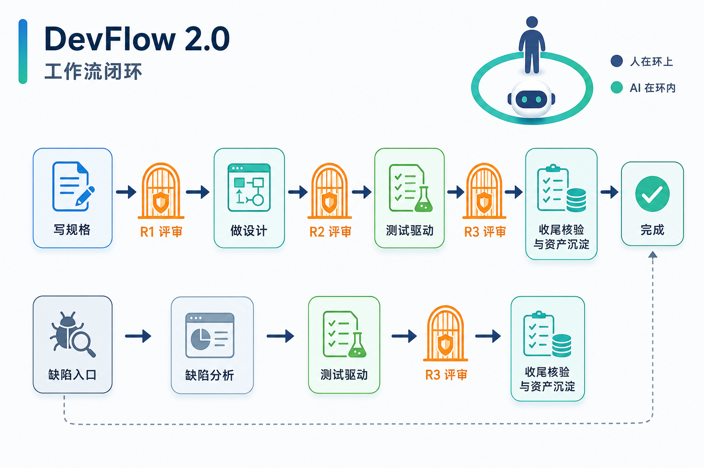

# DevFlow

[English](README.md) | [中文](README.zh-CN.md)

[](LICENSE)


**一套面向 AI coding agent 的开发流程技能：用 SDD 保证做对的事，用 TDD 证明行为正确，用 Clean Code 保证代码值得长期持有。**

DevFlow 把严谨的 AI 辅助工程工作流打包成自包含 Markdown skills：规格、设计、测试先行实现、独立评审、缺陷修复、工程收尾，以及语言/领域质量叠加约束。



---

## 命令

DevFlow 提供 slash-style 阶段入口，作为很薄的平台适配层。真正的流程权威在 `skills/<name>/SKILL.md`；命令只表达意图并加载对应技能。

| 你要做什么 | 命令 | 技能 | 核心原则 |
|------------|------|------|----------|
| 进入或恢复 DevFlow | `/devflow` | `using-devflow` | 从工件恢复 |
| 定义要做什么 | `/devflow-specify` | `devflow-specify` | 先 spec 再代码 |
| 规划怎么做 | `/devflow-design` | `devflow-design` | 先设计再实现 |
| 用测试构建 | `/devflow-build` | `devflow-tdd` | RED -> GREEN -> REFACTOR |
| 评审工件 | `/devflow-review` | `devflow-review` | 作者不自审 |
| 关闭工程工作 | `/devflow-ship` | `devflow-ship` | DoD 通过再 closeout |
| 修复缺陷 | `/devflow-fix` | `devflow-fix` | 先复现再修复 |

`devflow-clean-code`、语言规范和领域规范没有独立命令。它们是质量叠加约束，在设计、实现、评审阶段内部被消费。

---

## 快速开始

让你的 Agent Skills runtime 指向本仓库的 `skills/` 目录，或把 DevFlow vendor 到目标项目中。OpenCode 细节见 [docs/guides/opencode-setup.md](docs/guides/opencode-setup.md)；Cursor、Claude Code 等支持 Agent Skills 的运行时也适用同一模型。

```bash
# 方案 A：作为旁路 skill pack
git clone https://github.com/hujianbest/devflow.git ~/devflow
cd /path/to/your-repo && ln -s ~/devflow/skills .opencode-skills

# 方案 B：vendor 进你的仓库
git subtree add --prefix .devflow https://github.com/hujianbest/devflow.git --squash main
```

试一下：

```text
使用本仓库的 DevFlow。
我想给 notifications 组件增加重试机制。
先澄清需求，不要直接写代码。
```

项目级覆盖：在目标仓库根目录创建带 `## Project overrides` 章节的 `AGENTS.md`，可覆盖工件路径与模板；不创建时使用内置默认值。

---

## 看它如何工作

```text
You:    使用本仓库的 DevFlow。给 notifications API 增加限流。
        不要直接写代码。

DF:     从 `using-devflow` 进入，确认运行模式，解析目标组件根目录；
        由于没有已批准 spec，路由到 `devflow-specify`。

You:    spec 完成后继续 DevFlow。

DF:     运行独立的 `devflow-review` 门禁。规格通过且运行模式允许继续后，
        `devflow-design` 写组件/工作项设计、接口契约、错误模型和测试设计。

You:    构建已批准的设计。

DF:     `devflow-tdd` 细化 `plan.md`，一次实现一个任务，记录
        RED -> GREEN -> REFACTOR 证据，叠加 `devflow-clean-code`
        和适用语言/领域规范，并把证据行更新到磁盘。

You:    验证并关闭工作。

DF:     `devflow-review` 用独立上下文评审测试和代码。`devflow-ship`
        执行 Definition of Done、promotion 长期文档资产，并写入
        `closeout.md`，等待人工最终确认。
```

工作流启动时 DevFlow 只记录一次运行模式：默认 `attended`，评审 verdict 后停下给人确认；也可以选择 `unattended`，长时间连续执行，但独立评审、记录落盘、critical 阻塞和事后人工审计仍然保留。

---

## 全部 Skills

DevFlow 当前包含 17 个核心 skills：7 个阶段技能、9 个质量叠加技能、1 个工具技能。

### 阶段技能

| Skill | 做什么 | 什么时候用 |
|-------|--------|------------|
| [using-devflow](skills/using-devflow/SKILL.md) | 入口、工作流地图、工件约定、恢复规则、行为准则 | 开始、恢复，或不确定 DevFlow 下一步该做什么 |
| [devflow-specify](skills/devflow-specify/SKILL.md) | 把意图写成可测试规格：EARS、BDD 验收、NFR QAS、追溯矩阵 | 功能/变更需要先明确需求 |
| [devflow-design](skills/devflow-design/SKILL.md) | 产出组件/工作项设计、边界、契约、错误模型、取舍和测试设计 | 规格已批准，需要技术设计 |
| [devflow-tdd](skills/devflow-tdd/SKILL.md) | 用 RED -> GREEN -> REFACTOR 实现，记录任务证据，约束断言强度和 mock 边界 | 设计已批准，进入实现 |
| [devflow-review](skills/devflow-review/SKILL.md) | 独立评审规格、设计、测试或代码，产出 findings 和 verdict | 阶段工件准备过门禁 |
| [devflow-ship](skills/devflow-ship/SKILL.md) | 核验 Definition of Done，promotion 长期资产，写 closeout | 评审闭环，工程工作准备收尾 |
| [devflow-fix](skills/devflow-fix/SKILL.md) | 缺陷处理：复现、根因、最小修复边界、TDD 修复 | 遇到回归、bug、hotfix 或已发布行为缺陷 |

### 质量叠加技能

| Skill | 做什么 | 什么时候用 |
|-------|--------|------------|
| [devflow-clean-code](skills/devflow-clean-code/SKILL.md) | 语言无关的整洁代码标准：命名、函数、控制流、错误处理、注释、重构 | 编写、重构或评审实现代码与测试代码 |
| [c-coding-standards](skills/c-coding-standards/SKILL.md) | C 规则：所有权、内存/资源、缓冲区、整数、宏、头文件、错误返回 | 工作触及 C 源码、头文件或 C 测试 |
| [cpp-coding-standards](skills/cpp-coding-standards/SKILL.md) | C++ 规则：RAII、所有权签名、类设计、错误策略、模板纪律、ABI | 工作触及 C++ 源码、类、模板或 C++ 测试 |
| [java-coding-standards](skills/java-coding-standards/SKILL.md) | Java 规则：null/Optional、equals/hashCode 契约、资源管理、异常策略、不可变、泛型、并发 | 工作触及 Java 源码、record 或 JUnit 测试 |
| [python-coding-standards](skills/python-coding-standards/SKILL.md) | Python 规则：可变默认参数、类型注解、EAFP 异常、上下文管理器、身份/相等、dataclass、导入 | 工作触及 Python 模块、包或 pytest 测试 |
| [embedded-development](skills/embedded-development/SKILL.md) | 嵌入式约束：内存、中断、实时性、硬件边界、证据策略 | 固件、驱动、HAL、RTOS 或资源受限设备工作 |
| [automotive-development](skills/automotive-development/SKILL.md) | 车载约束：ASIL、整车生命周期、SOA、DTC、SELinux、跨 ECU 协同 | ECU、域控、车载服务或整车平台工作 |
| [frontend-development](skills/frontend-development/SKILL.md) | 前端约束：状态与渲染、数据四态、性能预算、可访问性、客户端安全 | 组件、页面、状态、表单或 Web UI 工作 |
| [backend-development](skills/backend-development/SKILL.md) | 后端约束：API 契约、数据一致性、幂等、鉴权、限流、可观测性 | API、服务/仓库层、数据库或服务端工作 |

### 工具技能

| Skill | 做什么 | 什么时候用 |
|-------|--------|------------|
| [coding-standards-creator](skills/coding-standards-creator/SKILL.md) | 把团队内部编码规范转化为新的 `<language>-coding-standards` skill | 团队需要新增或修订某语言规范 |

语言规范按约定扩展：工作触及语言 X，就加载已存在的 `<x>-coding-standards`。新增语言技能遵循同一份[结构契约](skills/coding-standards-creator/references/coding-standards-skill-contract.md)，所以阶段技能不需要为每种语言改写。

---

## DevFlow 方法

DevFlow 不是 prompt 集合，而是一套轻量、基于证据的工作流，用来让 AI agent 产出可审查、可信、可维护的代码。

| 层 | DevFlow 方法 | 为什么重要 |
|----|--------------|------------|
| Intent | Spec-driven development | 防止 agent 靠猜补全需求 |
| Planning | 组件/工作项设计 | 在代码前显式化边界、契约、错误模型和测试 |
| Execution | Test-driven development | 把“看起来对”变成由测试证明的行为 |
| Internal quality | Clean Code 叠加约束 | 保持代码可读、简单、可维护、可评审 |
| Review | 独立门禁 | 分离作者身份和判断权 |
| Recovery | 工件优先状态 | 让另一个 agent 或人能从文件恢复，而不是依赖聊天记忆 |
| Closeout | DoD 与 promotion | 记录改了什么、通过了什么、哪些文档成为长期资产 |

DevFlow 的协作姿态是 **human-on-the-loop**：AI 做具体工作，人审查关键工件和决策。理念见 [docs/devflow-philosophy.md](docs/devflow-philosophy.md)，架构见 [docs/devflow-core-architecture.md](docs/devflow-core-architecture.md)。

---

## Skills 如何工作

每个 skill 都是自包含操作规程：

```text
SKILL.md
├── 触发条件
├── 工作流步骤
├── 必要工件
├── 证据与评审契约
├── 质量规则与正反例
├── 红旗与合理化陷阱
└── 验证清单
```

关键设计选择：

- **流程最小化。** DevFlow 只保留能产生质量的阶段工件、人审把关点、TDD 纪律和独立评审。
- **内容最大化。** 每个 skill 的主体是工程判断：规则、例子、失败模式、清单和评审 rubric。
- **证据优先于记忆。** 进度从 `plan.md`、`reviews/`、`traceability.md` 和工件文件本身恢复。
- **作者不自审。** 创建工件的 agent 不批准自己的工件。

---

## 项目结构

```text
devflow/
├── skills/                         # 17 个核心 skills
│   ├── using-devflow/              # 入口与恢复规则
│   ├── devflow-specify/            # 可测试规格与追溯矩阵
│   ├── devflow-design/             # 组件/工作项设计
│   ├── devflow-tdd/                # 测试先行实现
│   ├── devflow-review/             # 独立评审门禁
│   ├── devflow-ship/               # DoD、promotion、closeout
│   ├── devflow-fix/                # 缺陷路径
│   ├── devflow-clean-code/         # 语言无关 Clean Code
│   ├── c-coding-standards/         # C 叠加约束
│   ├── cpp-coding-standards/       # C++ 叠加约束
│   ├── java-coding-standards/      # Java 叠加约束
│   ├── python-coding-standards/    # Python 叠加约束
│   ├── embedded-development/       # 嵌入式叠加约束
│   ├── automotive-development/     # 车载叠加约束
│   ├── frontend-development/       # 前端叠加约束
│   ├── backend-development/        # 后端叠加约束
│   └── coding-standards-creator/   # 语言规范生成器
├── commands/                       # slash-style 阶段入口
├── agents/                         # devflow-reviewer / devflow-implementer 子代理角色
├── docs/
│   ├── devflow-philosophy.md
│   ├── devflow-core-architecture.md
│   ├── devflow-internal-quality.md
│   ├── guides/
│   └── asserts/
├── scripts/                        # 仓库一致性检查
├── tests/
├── CONTRIBUTING.md
└── README.md
```

每个工作项的过程工件位于目标组件仓库，默认是 `features/<id>-<slug>/`：`spec.md`、`traceability.md`、`design.md`、`plan.md`、`reviews/`、`closeout.md` 或 `fix.md`。长期资产如 `docs/component-design.md`、`docs/ar-specs/`、`docs/ar-designs/` 在 `devflow-ship` 阶段 promotion。

---

## 范围边界

DevFlow 覆盖从已接受需求到完成评审与 closeout 的工程开发段。它不负责产品发现、发布运维、系统/集成/验收测试、线上事故管理或生产 rollout；也不替团队拍板业务方向、优先级、验收阈值和架构边界。

---

## 贡献

见 [CONTRIBUTING.md](CONTRIBUTING.md)。请保持 skills 具体、可验证、带正反例，并尽量减少流程样板。

---

## License

[MIT](LICENSE)
