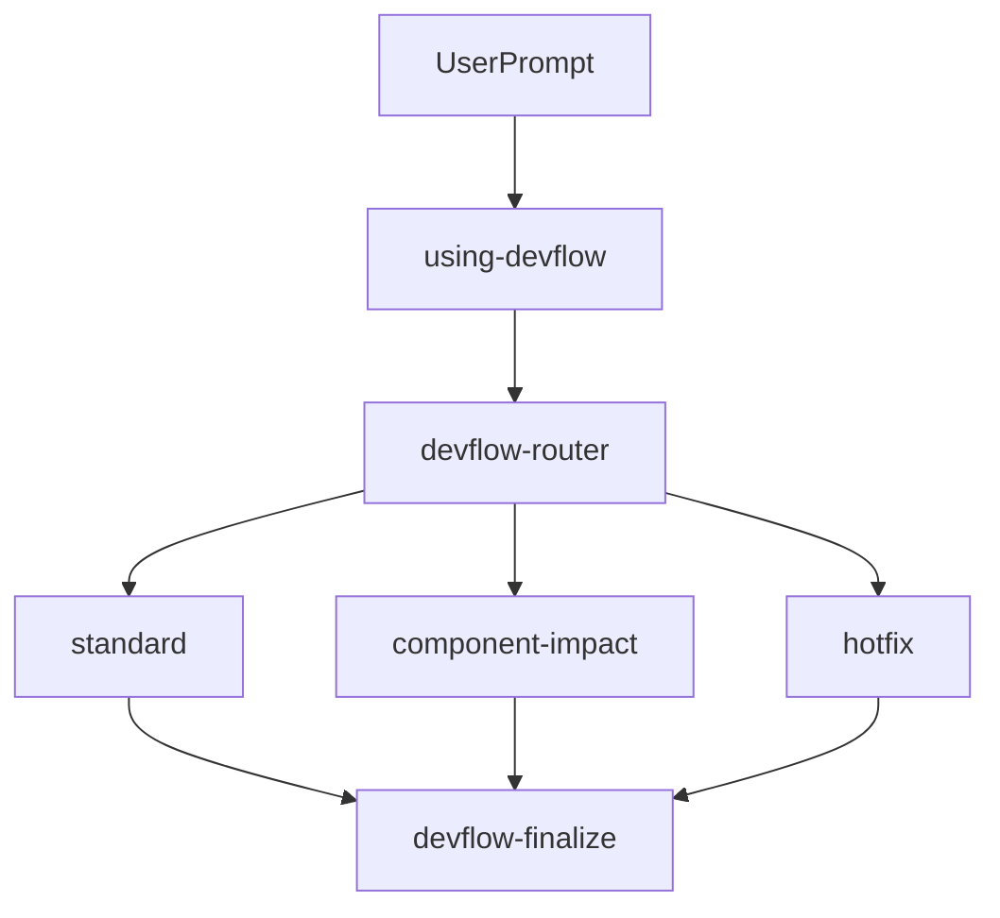
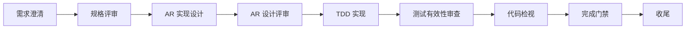
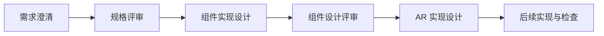
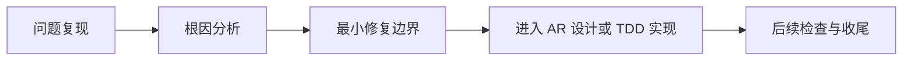
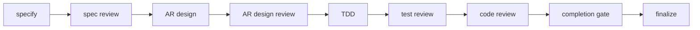

# DevFlow：一套 skills 把 AI Coding 变成高质量的工作流

> AI Coding了几个月之后，最终还是Coding了一套适合在我司使用的skills--DevFlow，所谓的造轮子，目的是匹配眼下的团队软件开发微流程，从需求到实现设计，到编码再到开发者测试，当然也用到了前面文章提到的[SDD]()、[TDD]()、[Harness Engineering]()的方法。
> 
> 在此之外，我在这套工作流skills中，加了很多过程记录件。比如每一次检视的结果、TDD的实现记录、能说明任务已完成的证据，让我可以审计AI有没有偷懒，或者让另一个Agent来审计。

**AgentCenter skills下载地址：[DevFlow]()**

## 1. AI写的代码与商用交付的GAP在哪
  
### 1.1 AI Coding过程中，我们在抱怨什么  
  
AI 经常改得快却说不清原因，修个 Bug 还能顺手把你架构改了；它声称“已经完成”，但测试证据、review 记录、完成标准都不完整；换一个新会话之后，前面的上下文像断片一样，只能靠模型从聊天记录里猜。  
  
更深一层的问题是：AI Coding 常常把工程活动压缩成一段对话。需求澄清、设计取舍、实现过程、测试结果、代码审查、完成判断都混在一起。短期看很流畅，长期看很难追踪。    
  
如果 AI Coding 只服务个人探索，这些问题也许可以忍。但如果它要进入团队研发流程，这些问题就会变成协作成本和质量风险。  
  
### 1.2 SDD的开发范式解决了什么
  
SDD，也就是 Spec-Driven Development，已经向前走了一大步。它提醒我们不要一上来就让 Agent 写代码，而是先把意图写清楚：需求是什么，边界是什么，验收标准是什么，设计方案是什么，测试应该覆盖什么。  
  
这解决了 AI Coding 里一个很关键的问题：从“边聊边做”转向“先定义，再实现”。规格和设计让 Agent 不再只依赖模糊 prompt，也让团队有机会在实现前发现范围、接口、验收标准上的问题。  

### 1.3 为什么仍不信任AI写到代码

既然有了 SDD 明确意图，为什么商用交付团队还是不敢对 AI 彻底放权？因为“纸上谈兵”和“落地执行”之间，还隔着四道过不去的坎：

- 缺乏过程监督（自说自话）： 规格是写好了，但代码实现时 AI 有没有跑偏？如果依然是同一个 Agent 既写代码又做测试，无异于“既当运动员又当裁判”，质量全是注水的。
    
- 缺乏确定性的测试（应付了事）： 商用交付要求严苛的边界和异常处理，而 AI 默认只会写最理想的 Happy Path 测试用例，容易漏掉真正的隐患。
    
- 上下文脆弱（无法读档）： 真实的开发周期很长，一旦聊天窗口意外关闭或跨天协作，AI 建立的语境就彻底丢了，项目无法无缝接班。
    
- 缺乏全链路一致性（无法追溯）： 从最初的需求，到最终的测试用例，中间的代码修改是否百分之百对齐？没人敢打包票，缺乏一条可追溯的证据链。

## 2. DevFlow的思路

DevFlow 的核心方向，就是把 AI Coding **从“能力驱动”变成“证据驱动”，从“聊天协助”变成“可审计工作流”**。

+ **开发活动拆分**：DevFlow 把一次 AI 参与的开发工作拆成显式阶段：规格、设计、TDD 实现、测试有效性审查、代码检视、完成门禁、收尾。每个阶段都有自己的输入、输出、角色边界和进入条件。  
+ **设计先行**：DevFlow也采用SDD的范式，通过提供极其精确的规格说明（Spec）——包括前置条件、后置条件、输入输出结构、异常处理逻辑等，为 AI 画定严格的“边界”。
+ **测试先行**：在规约驱动下，Spec 就是天然的测试大纲。DevFlow在代码实现阶段采用TDD的方式，先由Spec生成测试用例，再按TDD的方式完成用例和业务代码的编写。
+ **结对编程**：引入多 Agent 机制，一个 Agent 埋头干活，另一个 Agent 独立审查，各司其职，而不是在同一个上下文中既当运动员又当裁判。
+ **作业过程可审查**：DevFlow 不把聊天当作唯一事实来源，它要求关键状态和证据落到磁盘 artifacts 里。新的会话、新的 Agent、新的 reviewer，都应该能从磁盘里恢复当前状态，而不是从聊天记忆里猜。
+ **一致性审查**：打通全链路，在需求、设计、代码和用例之间建立强关联关系，确保每行变更都师出有名、每个功能都查有实据。

## 3. DevFlow 的适用场景与核心流程
  
### 3.1 DevFlow 是什么  
  
DevFlow 是一套面向需求澄清、设计、实现、评审和收尾的 **AI 协作流程 skills**。它适合处理团队已经接受的 SR、AR、DTS 或 CHANGE，把输入推进成可追溯、可评审、可验证的工程产物。  
  
DevFlow 不负责产品发现，也不替需求负责人、模块架构师、开发负责人做业务或架构拍板。它的价值是把已经决定要处理的工作项，按稳定流程落到规格、设计、代码、测试证据和收尾记录中。  
  


  
### 3.2 DevFlow 适合解决什么问题  
  
DevFlow 适合处理团队已经接受、但仍需要工程化落地的工作项：  
  
- 把模糊的 SR / AR / CHANGE 输入澄清成可评审的 `requirement.md`。  
- 在新增组件、修改组件职责、SOA 接口、依赖、状态机或运行机制时，沉淀 `component-design-draft.md` 并同步长期组件设计。  
- 为单个 AR 编写代码层实现设计，将测试设计作为 AR 设计的一部分。  
- 按 TDD 推进实现任务，并保留 RED / GREEN / REFACTOR 证据。  
- 对测试有效性、代码质量、完成状态做独立审查。  
- 对 DTS / Hotfix 先做复现、根因分析和最小安全修复边界确认。  
  
**核心概念**  
  
| 概念 | 说明 |  
|---|---|  
| Work Item | DevFlow 的输入单元，包括 SR / AR / DTS / CHANGE。 |  
| Skill Node | 一个可独立触发的流程节点，例如 `devflow-specify`、`devflow-ar-design`、`devflow-code-review`。 |  
| Artifact | 流程产生或消费的磁盘工件，例如 `requirement.md`、`tasks.md`、`reviews/code-review.md`。 |  
| Profile | 路由密度，包括 `standard`、`component-impact`、`hotfix`、`lightweight`。 |  
| Gate | 质量门禁，例如 spec review、design review、test review、code review、completion gate。 |  
  
### 3.3. DevFlow 的基本流程  
  
日常使用时，用户可以从 `using-devflow` 开始。它是 DevFlow 的 front controller：如果用户已经明确要进入某个节点，并且磁盘工件支持这个判断，就 direct invoke 对应 skill；否则交给 `devflow-router` 先路由。  
  
`devflow-router` 是运行时权威。它读取目标组件仓库中的 `features/<id>/`、`docs/`、评审记录和 evidence，再选择下一步。Profile 由工件和风险信号决定，不由 agent 随口选择。  
  

  
### 3.3.1 普通 AR 的主流程：  
  

  
### 3.3.2 如果影响组件边界，会在规格评审后插入组件实现设计：  
  

  
### 3.3.3 如果是 DTS / Hotfix，会先做问题分析：  
  

  
### 3.4 使用时的基本原则  
  
- 不知道入口时，直接说明目标，让 AI 判断应该进入哪个 DevFlow 节点。  
- 需求规格未通过评审前，不进入设计。  
- 组件实现设计未通过评审前，不进入依赖它的 AR 实现设计。  
- AR 实现设计未通过评审前，不进入 TDD 实现。  
- TDD 完成后，不能直接进入代码检视，必须先做测试有效性审查。  
- 代码检视通过后，不能直接宣布完成，必须经过完成门禁。  
- SR 只做需求分析和可选组件设计修订，不在同一个 SR 工作项里直接进入实现。  
- Hotfix 只压缩路径，不跳过复现、根因、测试检查、代码检视和完成门禁。  
  
## 4. 安装与准备

### 4.1 安装

以opencode为例，把需要的 skill 目录复制到项目或个人的 `.opencode/skills/` 位置，command复制到 `.opencode/commands` 位置，agent复制到 `.opencode/agents` 位置。

安装完后相关内容如下：

```text
skills/
  using-devflow/
  devflow-router/
  devflow-specify/
  devflow-spec-review/
  devflow-component-design/
  devflow-component-design-review/
  devflow-ar-design/
  devflow-ar-design-review/
  devflow-tdd-implementation/
  devflow-test-review/
  devflow-code-review/
  devflow-completion-gate/
  devflow-finalize/
  devflow-problem-fix/
commands/
  devflow.md
  devflow-specify.md
  devflow-design.md
  devflow-build.md
  devflow-ship.md
  devflow-fix.md
agents/
  devflow-reviewer.md
  devflow-implementer.md
```

在目标组件仓库中，建议准备 `AGENTS.md` 或等价团队规则文件，用来声明构建命令、测试命令、代码规范、默认工件目录和已有团队目录的映射。没有团队覆盖时，DevFlow 使用本文档中的默认布局。

### 4.2 快速开始

可以从 `/devflow` 进入，让 DevFlow 根据工件证据路由；也可以继续用自然语言描述目标。

```text
我要实现 AR20260424903293，需求背景是 XXX，所属组件是 YYY......
```

```text
请读取当前已有工件，继续推进这个 AR。
```

```text
这是一个 DTS / Hotfix，问题是xxxx，请先做复现、根因分析和最小修复边界。
```

也可以指定某个节点：

```text
请按 DevFlow 澄清这个 AR 的需求。
请按 DevFlow 评审这个 requirement.md。
请按 DevFlow 编写 AR 实现设计。
请按 DevFlow 对当前 active task 做 TDD 实现，并保留最新证据。
请按 DevFlow 先审查测试有效性，再进行代码检视。
请按 DevFlow 判断这个 AR 是否可以完成。
请按 DevFlow 收尾这个工作项。
```

第一次运行时，Agent 应先读取目标仓库约定、已有 `features/<id>/` 工件和相关 `docs/` 资产，再判断进入哪个节点。


### 4.3 技能目录

按"你想做什么"挑技能；DevFlow 会从入口技能自动路由。

| 你想做… | Skill | 关键原则 |
|---|---|---|
| 决定从哪里开始 | [`using-devflow`](skills/using-devflow/SKILL.md) | Front controller，direct invoke vs route-first |
| 让 agent 从工件证据决定下一步 | [`devflow-router`](skills/devflow-router/SKILL.md) | 基于证据的 FSM 路由 |
| 把 SR / AR / DTS / CHANGE 澄清成可评审的需求规格 | [`devflow-specify`](skills/devflow-specify/SKILL.md) | EARS、BDD、MoSCoW、INVEST、NFR QAS |
| 独立评审需求规格 | [`devflow-spec-review`](skills/devflow-spec-review/SKILL.md) | author/reviewer 分离、结构化 walkthrough |
| 写或修组件实现设计 | [`devflow-component-design`](skills/devflow-component-design/SKILL.md) | SOA 边界 + Design Options checkpoint |
| 独立评审组件实现设计 | [`devflow-component-design-review`](skills/devflow-component-design-review/SKILL.md) | 角色分离 verdict |
| 写 AR 实现设计（含测试设计章节） | [`devflow-ar-design`](skills/devflow-ar-design/SKILL.md) | 代码层设计 + 防御式 C/C++ + 内嵌测试设计 |
| 独立评审 AR 设计与测试设计 | [`devflow-ar-design-review`](skills/devflow-ar-design-review/SKILL.md) | 独立设计与测试设计审 |
| 用 TDD 实现（单 active task + fresh evidence） | [`devflow-tdd-implementation`](skills/devflow-tdd-implementation/SKILL.md) | task queue setup、RED/GREEN/REFACTOR、implementer subagent |
| 检查测试是否真有效 | [`devflow-test-review`](skills/devflow-test-review/SKILL.md) | TDD 后测试有效性独立审查 |
| C / C++ 代码检视 | [`devflow-code-review`](skills/devflow-code-review/SKILL.md) | Fagan 风格 + 嵌入式 C/C++ 风险 + SOA 边界 |
| 判断当前是否可以完成 | [`devflow-completion-gate`](skills/devflow-completion-gate/SKILL.md) | DoD + evidence bundle |
| 收尾 / 同步长期资产 / 交接 | [`devflow-finalize`](skills/devflow-finalize/SKILL.md) | closeout pack + 长期资产 promotion |
| 复现 / 根因 / 最小修复边界（DTS / Hotfix） | [`devflow-problem-fix`](skills/devflow-problem-fix/SKILL.md) | 复现 + 根因分析 + 最小安全修复 |

评审节点都由 `devflow-router` 派发**独立 subagent**，subagent 以对应的 `devflow-*-review`（或 `devflow-test-review` / `devflow-code-review`）skill 作为 system prompt。Reviewer subagent 只读被评审工件并返回结构化 verdict，不修改工件。

### 4.4 Command 与 Skill 的对应关系

Command 是用户视角的阶段入口，负责把一次请求推进到合适阶段；Skill 是实际执行规则，定义每个 canonical 节点怎么做。Command 不复制、不替代 `SKILL.md`，也不绕开 `devflow-router`、独立评审和完成门禁。  
  
| Command | 阶段 | 内部对应 skills |  
|---|---|---|  
| [`/devflow`](commands/devflow.md) | 入口 / 续作 | `using-devflow` → 按需 `devflow-router` |  
| [`/devflow-specify`](commands/devflow-specify.md) | 规格阶段 | `devflow-specify` → `devflow-router` 派发 `devflow-spec-review` |  
| [`/devflow-design`](commands/devflow-design.md) | 设计阶段 | 按需 `devflow-component-design` → `devflow-component-design-review` → `devflow-ar-design` → `devflow-ar-design-review` |  
| [`/devflow-build`](commands/devflow-build.md) | 构建阶段 | `devflow-tdd-implementation` → `devflow-test-review` → `devflow-code-review` |  
| [`/devflow-ship`](commands/devflow-ship.md) | 收尾阶段 | `devflow-completion-gate` → `devflow-finalize` |  
| [`/devflow-fix`](commands/devflow-fix.md) | Hotfix / DTS | `devflow-router` 升级 hotfix → `devflow-problem-fix` → 回到 build / ship 链路 |  
  
评审类 skill 必须由 `devflow-router` 派发独立 reviewer subagent；实现类 task 由 `devflow-tdd-implementation` 派发 implementer subagent。`auto` execution mode 只减少阶段间人工确认，不豁免任何评审、门禁或证据要求。

### 4.5 各阶段用到的软件方法论

| 阶段 | Skill | 方法 |
|---|---|---|
| 入口 | `using-devflow` | Front controller，direct-invoke vs route-first |
| 路由 | `devflow-router` | 基于证据的 FSM 路由、profile 选择、从工件恢复 |
| 规格澄清 | `devflow-specify` | EARS、BDD acceptance、MoSCoW、INVEST、NFR QAS |
| 规格评审 | `devflow-spec-review` | Structured walkthrough、checklist review、author/reviewer 分离 |
| 组件设计 | `devflow-component-design` | SOA 边界分析、Clean Architecture 边界、接口隔离、Design Options checkpoint |
| 组件设计评审 | `devflow-component-design-review` | 独立组件设计评审、角色分离 verdict |
| AR 设计 | `devflow-ar-design` | 代码层设计、防御式 C/C++ 设计、内嵌测试设计、Design Options checkpoint |
| AR 设计评审 | `devflow-ar-design-review` | 独立 AR 设计与测试设计评审 |
| TDD 实现 | `devflow-tdd-implementation` | task queue setup、单 active task、RED/GREEN/REFACTOR、fresh evidence、implementer subagent context pack |
| 测试有效性审查 | `devflow-test-review` | 测试有效性、覆盖、mock/stub 边界、证据新鲜度 |
| 代码检视 | `devflow-code-review` | Fagan inspection、嵌入式 C/C++ 风险、SOA 边界检查 |
| 完成门禁 | `devflow-completion-gate` | Definition of Done、evidence bundle、下一 task vs finalize 判断 |
| 收尾 | `devflow-finalize` | closeout pack、长期资产同步、handoff |
| 问题修复 | `devflow-problem-fix` | 复现、根因分析、最小安全修复边界 |

## 5. 使用示例

关键流程




## 6. 关键特性说明

### 6.1 DevFlow的交付件

DevFlow 的交付不只是代码 diff，还包括能解释“为什么这样改、如何验证、谁审过、是否完成”的工件链。

默认过程工件位于组件仓库的 `features/<id>/`：

```text
features/<id>/
  README.md
  progress.md
  requirement.md
  component-design-draft.md
  ar-design-draft.md
  tasks.md
  task-board.md
  traceability.md
  implementation-log.md
  reviews/
    spec-review.md
    component-design-review.md
    ar-design-review.md
    test-check.md
    code-review.md
  evidence/
  completion.md
  closeout.md
```

长期资产位于组件仓库的 `docs/`：

```text
docs/
  component-design.md
  ar-specs/                  # AR 规格
  ar-designs/                # AR 实现设计
```

问题修复还会关注：

```text
features/DTS<id>-<slug>/
  reproduction.md
  root-cause.md
  fix-design.md
```

如果目标组件仓库已有不同目录结构，DevFlow 应优先读取项目级 `AGENTS.md` 或团队规则中的等价路径。

### 6.2 开发过程可追溯、可审计

#### 6.2.1 开发过程可审计，防偷懒

`implementation-log.md`记录TDD开发过程中的记录和证据，说明task无遗漏。


#### 6.2.2 设计/开发/测试衔接可追溯

`traceability.md`记录追溯矩阵，确保规范驱动开发的`规范`被有效继承和实现。


### 6.3 subagent-driven

在 DevFlow中，subagent-driven并不是简单地“多开几个Al帮手"，而是一种围绕职责边界设计的协作机制：主Agent 负责理解流程状态、读取工件、决定下一步。而具体的评审、实现等高风险任务则交给独立的 Subagent 执行。 

比如评审节点由独立reviewer subagent完成，避免主Agent 自写自审；TDD实现阶段则由implementer subagent根据精简后的上下文包推进具体任务。 减少主会话的上下文负担。

这样的设计让 DevFlow 从"一个 Agent 端到端凭记忆推进"转变为"主流程编排 + 专职子代理执行+ 工件沉淀"的模式，在提升自动化能力的同时，也保留了角色分离、可追踪性和质量门禁。

### 6.4 skills设计原则

DevFlow 的 skils 结 构设计，核心原则是把复杂研发流程拆成一组边界清晰、可组合、可审计的工作节点。每个 skil 只负责一个明确阶段。例 如需求澄清、规格评审、组件设计、AR 设计、TDD 实现、测试评审、代码评审和最终收口。

节点之间通过标准化工件和 handoff字段衔接，而不是依赖 Agent 的聊天记忆。 这样的结构让流程具备“可恢复性"，即使换了会话、换了 Agent, 也能 通过progress.md、reviews/、evidence/等磁盘工件判断当前进度和下一步。

同时，DevFlow还把authoring、 review、gate 这些职责拆成不同 skill，并通过路由规则保证评审不能被内联、自审不能发生、质量门禁不能跳过。DevFlow 的 skils 不是一组松散提示词，是一套带有角色边界、状态契约和流程约束的工程化执行结构。

每个 skill 都是一份自包含的操作规程：  
  
```text  
SKILL.md  
├── Frontmatter classifier  
├── Overview and trigger conditions  
├── Hard gates and object contract  
├── Step-by-step workflow  
├── Required artifacts and evidence  
├── Review or gate contract  
├── Red flags and common rationalizations  
├── Verification checklist  
└── Local DevFlow conventions  
```

## 7. 适配我司开发场景

### 场景 1：新增组件，编写组件实现设计

适用情况：

当一个工作项会新增组件，或修改组件职责、SOA 接口、组件依赖、状态机、运行机制时，应该先通过 DevFlow 做组件实现设计，不能直接进入 AR 代码层实现设计。

关键流程：

```text
需求澄清 -> 规格评审 -> 组件实现设计 -> 组件设计评审 -> AR 实现设计
```

你可以这样说：

```text
你：
我要新增一个 XXX 组件，请按 DevFlow 先帮我澄清需求，并进入组件实现设计。

AI：
我会先判断这是 SR 分析还是 AR 实现工作项，澄清需求并生成 requirement.md。
规格评审通过后，如果确认影响组件边界，会进入组件实现设计，产出 component-design-draft.md，并派发独立组件设计评审。
```

产物结果：

- `features/<id>/requirement.md`
- `features/<id>/reviews/spec-review.md`
- `features/<id>/component-design-draft.md`
- `features/<id>/reviews/component-design-review.md`
- 收尾时同步到 `docs/component-design.md`

### 场景 2：修改组件接口或依赖关系

适用情况：

当 AR 不是新增组件，但会改 SOA 服务接口、参数语义、错误码、依赖方向、初始化顺序、状态机或运行时机制时，也属于组件影响场景。

关键流程：

```text
需求澄清 -> 规格评审 -> 组件实现设计修订 -> 组件设计评审 -> AR 实现设计
```

你可以这样说：

```text
你：
这个 AR 会修改 XXX 组件对外接口，请按 DevFlow 判断是否需要先修订组件实现设计。

AI：
我会先读取或建立需求规格，确认 Component Impact。
如果接口或依赖变化成立，会进入 component-impact 路径，先修订组件实现设计，再进入 AR 实现设计。
```

产物结果：

- 更新后的需求规格与影响判断
- `component-design-draft.md`
- 组件设计评审记录
- 后续 AR 实现设计输入

### 场景 3：普通 AR 功能实现

适用情况：

当需求已经被团队接受，且主要是既有组件内部行为变更，不影响组件职责、接口、依赖、状态机或运行机制时，走普通 AR 实现路径。

关键流程：

```text
需求澄清
  -> 规格评审
  -> AR 实现设计
  -> AR 设计评审
  -> TDD 实现
  -> 测试有效性审查
  -> 代码检视
  -> 完成门禁
  -> 收尾
```

你可以这样说：

```text
你：
我要实现 AR12345，需求背景是 XXX，所属组件是 YYY。请按 DevFlow 从需求澄清开始推进。

AI：
我会先把输入整理成 requirement.md，并明确范围、非范围、验收标准和追溯关系。
规格评审通过后，会进入 AR 实现设计，设计评审通过后再创建 task queue 并按 TDD 实现。
```

产物结果：

- `features/AR12345-<slug>/requirement.md`
- `features/AR12345-<slug>/ar-design-draft.md`
- `features/AR12345-<slug>/tasks.md`
- `features/AR12345-<slug>/task-board.md`
- `features/AR12345-<slug>/implementation-log.md`
- `features/AR12345-<slug>/reviews/`
- `features/AR12345-<slug>/evidence/`
- `features/AR12345-<slug>/completion.md`
- `features/AR12345-<slug>/closeout.md`
- 收尾时同步到 `docs/ar-designs/AR12345-<slug>.md`

### 场景 4：只做 SR 需求分析，不进入实现

适用情况：

当输入是子系统级 SR，目标是澄清范围、影响组件、候选 AR 拆分，或者决定是否需要修订组件设计时，走 SR 需求分析路径。SR 不会在同一个工作项中直接进入 AR 实现、TDD、测试检查或代码检视。

关键流程：

```text
需求澄清 -> 规格评审 -> 可选组件实现设计 -> 分析收尾
```

你可以这样说：

```text
你：
我有一个 SR，需要先分析清楚子系统范围、受影响组件和候选 AR，请按 DevFlow 做需求分析，不要进入实现。

AI：
我会把 SR 输入澄清成 requirement.md，补充 Affected Components、AR Breakdown Candidates 和 Component Design Impact。
如果规格评审判断需要修订组件设计，会进入组件实现设计；否则直接进入分析收尾。
```

产物结果：

- `features/SR<id>-<slug>/requirement.md`
- `features/SR<id>-<slug>/reviews/spec-review.md`
- 可选的 `component-design-draft.md`
- `features/SR<id>-<slug>/closeout.md`
- closeout 中的 `AR Breakdown Candidates` 供需求负责人后续新建 AR 工作项

### 场景 5：DTS / Hotfix 问题修复

适用情况：

当输入是 DTS、线上问题、紧急缺陷或回归问题时，不能直接让 AI 改代码。应先复现问题、确认根因和最小安全修复边界，再决定回到 AR 设计或 TDD 实现。

关键流程：

```text
问题复现 -> 根因分析 -> 最小修复边界 -> TDD 实现 -> 测试有效性审查 -> 代码检视 -> 完成门禁 -> 收尾
```

你可以这样说：

```text
你：
DTS67890 描述的是 XXX 问题，请按 DevFlow 先做复现、根因分析和最小修复边界，不要直接改代码。

AI：
我会先建立问题修复包，包括 reproduction.md、root-cause.md 和 fix-design.md。
只有复现、根因和修复边界足够清楚后，才会进入 TDD 实现或回到 AR / 组件设计。
```

产物结果：

- `features/DTS67890-<slug>/reproduction.md`
- `features/DTS67890-<slug>/root-cause.md`
- `features/DTS67890-<slug>/fix-design.md`
- 后续实现、评审、完成门禁和收尾产物

### 场景 6：继续一个进行中的 work item

适用情况：

当一个 AR / DTS / SR 已经有过程产物，但你不确定当前应该继续写设计、做评审、实现、补证据还是收尾时，让 AI 先按 DevFlow 路由判断。

关键流程：

```text
读取 progress.md / reviews / evidence -> 判断当前阶段 -> 路由到唯一下一步
```

你可以这样说：

```text
你：
继续 AR12345，请按 DevFlow 判断当前应该进入哪个阶段，然后推进下一步。

AI：
我会先读取 progress.md、reviews、evidence 和 completion 状态。
如果阶段清晰，会进入唯一下一步；如果证据冲突，会停下来说明冲突并回到路由判断。
```

产物结果：

- 更新后的 `progress.md`
- 对应阶段的新增或修订产物
- 必要时新增 review / gate 记录

### 场景 7：AR 设计已经完成，开始 TDD 实现

适用情况：

当 AR 实现设计和 AR 设计评审已经通过，需要把设计映射成任务队列并按 TDD 实现时，进入实现阶段。此时不能再随意扩大 AR 范围或补充未批准的新行为。

关键流程：

```text
AR 设计评审通过 -> 创建 / 校验 tasks.md -> 锁定 Current Active Task -> RED -> GREEN -> REFACTOR -> 测试有效性审查
```

你可以这样说：

```text
你：
AR12345 的 AR 设计已经评审通过，请按 DevFlow 创建任务队列，并开始第一个 TDD task。

AI：
我会先校验 ar-design-draft.md 和 ar-design-review.md，再创建或检查 tasks.md / task-board.md。
锁定唯一 Current Active Task 后，按 RED / GREEN / REFACTOR 执行，并记录 fresh evidence。
```

产物结果：

- `tasks.md`
- `task-board.md`
- 测试代码和生产代码变更
- `implementation-log.md`
- `evidence/{unit,integration,static-analysis,build}/`
- 下一步 `test-check`

### 场景 8：代码已经写完，判断是否可以完成

适用情况：

当实现已经完成并有测试证据，但还没有独立 test-check、code-review、completion-gate 时，不能直接宣布完成。

关键流程：

```text
测试有效性审查 -> 代码检视 -> 完成门禁 -> 收尾
```

你可以这样说：

```text
你：
AR12345 代码已经实现并跑过测试，请按 DevFlow 检查是否可以完成。

AI：
我会先确认是否已有 implementation-log 和 fresh evidence。
然后派发测试有效性审查，通过后进入代码检视；代码检视通过后，再运行完成门禁确认是否可以收尾。
```

产物结果：

- `reviews/test-check.md`
- `reviews/code-review.md`
- `completion.md`
- `closeout.md`
- 长期资产同步到 `docs/`

### 场景 9：只想评审某份产物

适用情况：

当你已经有某份规格、组件设计、AR 设计、测试或代码实现，需要 AI 按 DevFlow 做独立评审时，可以直接说明评审对象。评审者不会顺手修改被评审产物，只会给 verdict、findings 和下一步。

关键流程：

```text
读取被评审产物 -> 多维度审查 -> 输出 review record -> 给出唯一下一步
```

你可以这样说：

```text
你：
请按 DevFlow review 这份 AR 实现设计，重点检查测试设计章节是否足够支撑 TDD。

AI：
我会作为独立 reviewer 读取 ar-design-draft.md、requirement.md 和组件设计，检查设计完整性、组件一致性、嵌入式风险和测试设计充分性。
评审完成后会输出 ar-design-review.md，并给出通过、需修改或阻塞结论。
```

产物结果：

- 对应的 `reviews/<review-type>.md`
- 结构化 findings
- 唯一的 `next_action_or_recommended_skill`

## 8. 下载地址

**AgentCenter地址：[DevFlow]()**