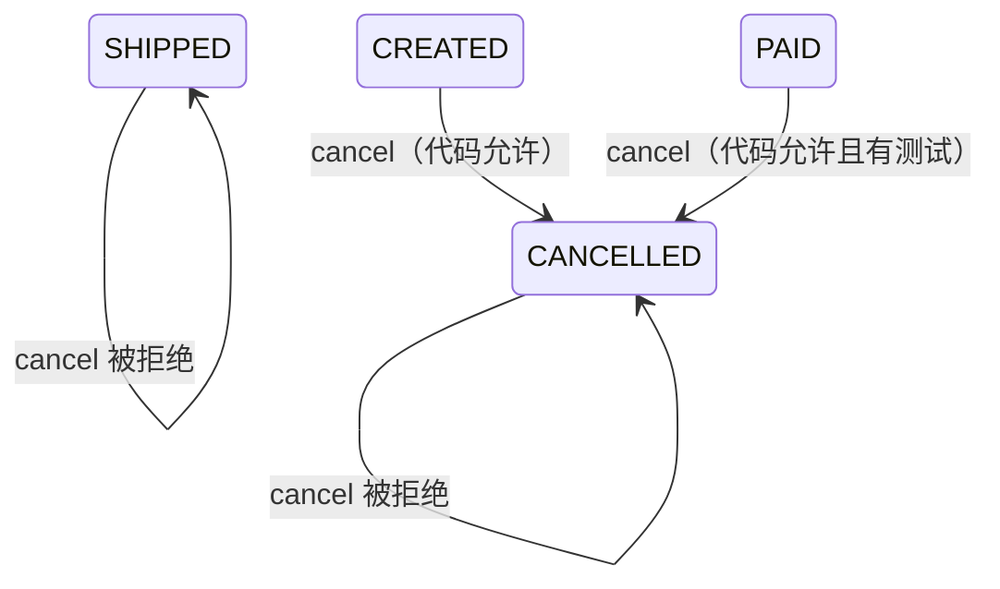

# 订单生命周期

## 当前实现状态集合

`OrderStatus` 定义四个状态：

| 状态 | 当前可证实行为 | 测试覆盖 |
|---|---|---|
| `CREATED` | `cancel` 可将其改为 `CANCELLED` | 未覆盖 |
| `PAID` | `cancel` 可将其改为 `CANCELLED` | 已覆盖成功示例 |
| `SHIPPED` | `cancel` 抛出 `ValueError`，不执行状态赋值 | 已覆盖拒绝示例 |
| `CANCELLED` | `cancel` 抛出 `ValueError`，不执行状态赋值 | 未覆盖 |

证据：`src/order_service.py:5-9,19-23`；`tests/test_order_service.py:6-14`。

## 取消相关状态图

图中的自环只表示调用失败后方法不会执行赋值，不证明并发、事务或外部持久化下状态必然保持不变。

## 已知转换规则

1. 允许集合是 `{CREATED, PAID}`。
2. 输入状态不在允许集合时，方法抛出消息为 `order cannot be cancelled in current status` 的 `ValueError`。
3. 成功时直接修改传入 `Order` 对象的 `status`，然后返回该对象。
4. 当前代码没有校验 `order_id`，也没有查询或持久化订单。

## 不可从当前材料推导的转换

没有证据说明：

- 订单如何进入 `CREATED`、`PAID` 或 `SHIPPED`；
- 支付、发货和取消之间是否有事务边界；
- 取消后能否恢复；
- 是否存在退货、退款、关闭、失败或过期状态；
- 状态变更是否需要时间戳、原因、操作者或版本号。

## 候选业务语义

- `CREATED → CANCELLED` 可能意味着释放预留库存，但库存预留本身未出现于输入。
- `PAID → CANCELLED` 可能要求退款，但当前方法只改内存状态。
- `SHIPPED` 后可能应使用退货而非取消，但没有退货契约或代码。

以上均未经过人工确认，不能据此实现副作用。
