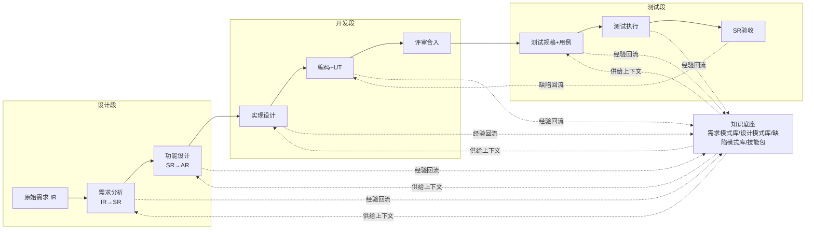
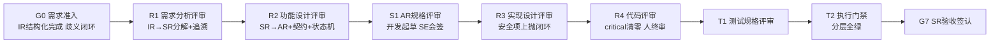
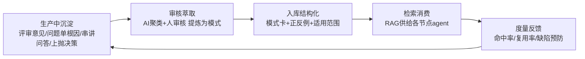

# AI 辅助研发变革方案：从三段接力到人机共线

> 适用对象：设计、开发、测试三段分设、运行 IR/SR/AR 需求分层体系、遵循 IPD 与车领域流程（ASPICE / ISO 26262）的研发团队。
> 本文回答四个问题：全流程 AI 打通怎么做、各节点文档输出要求、知识工程如何形成飞轮、交付小分队如何组织。

---

## 0. 现状诊断：钱花在哪儿，效率就漏在哪儿

当前模式是标准的职能接力：设计团队写需求分析说明书和功能设计说明书，开发团队听串讲、写实现设计、写代码，测试团队听串讲、写测试规格、跑验收。三段之间靠两类东西连接：文档和会议。

这套模式的损耗点不在任何一段内部，而在段与段之间的四次"翻译"：

| 断点 | 现象 | 代价 |
|------|------|------|
| IR → SR 分解 | 分解逻辑存在 SE 脑子里，说明书只写结论 | 下游看不到"为什么这么分"，变更影响靠人肉分析 |
| SR → AR 分解 | 功能设计说明书面向人读，接口、状态机、异常路径散落在文字里 | 开发要从文档里二次提取契约，提错、提全是常态 |
| SE → 开发串讲 | 两小时会议覆盖几十个 AR，听懂多少凭个人 | 理解偏差到联调才暴露，返工成本高 |
| SE → 测试串讲 | 测试对需求的理解滞后于开发一个身位 | 验收标准在测试段才被真正明确，发现问题已是晚期 |

还有一个隐性断点：每个项目结束后，评审意见、问题单根因、串讲问答这些最有价值的经验，留在邮件、会议纪要和个人的脑子里，下一个项目从零开始。

变革要改的不是"在某一段里用 AI 提效"，而是把这四次翻译交给机器可读的工件和 AI 产线，把人从"传话"里解放出来，去做机器做不了的判断。

## 1. 总体框架：一条产线、两类工件、三个闭环

三条主线同时建设，缺一不可：

1. **流程线（AI 产线）**：把 IR→SR→AR→设计→代码→测试→验收串成一条人机共线的流水线，每个节点定义清楚"AI 做什么、人审什么、门禁是什么"。详见第 2 节。
2. **文档线（人机共读工件）**：所有节点交付物从"写给人看的 Word"变成"人机共读的结构化工件"，机器可校验、可追溯、可检索，同时天然满足 IPD/ASPICE 的文档与追溯要求。详见第 3 节。
3. **知识线（飞轮）**：每个节点的产出和反馈结构化沉淀，喂给下游和下一轮使用。详见第 4 节。

组织线是载体：上述三条线跑在重新设计的交付小分队上。详见第 5 节。

业界参照：这条思路与 2025 年以来业界收敛的方向一致。微软把 spec-driven development 归纳为 Constitution → Specify → Clarify → Plan → Tasks → Implement → Validate 的生命周期（GitHub Spec Kit 为其开源实现）；AWS Kiro 用 EARS 句式做需求结构化再驱动设计、任务、代码；国内紫讯等公司把这条链路叫 AI-DLC，强调"需求塑形、方案收敛、分批实现、测试验证、经验回流"五段闭环。本方案与这些实践同源，差异在于针对 IR/SR/AR 分层和车领域合规做了本地化映射。

---

## 2. 问题一：全流程 AI 打通

### 2.1 任务分级模型：先分级，再谈自动化

把全流程的任务切成三类。分类不看"AI 会不会做"，看四个维度：产出能否被机器自动验证、出错的风险等级（安全/合规/资损）、有无先例模式可循、出错后谁承担责任。

| 级别 | 定义 | 人的位置 | 典型任务 |
|------|------|----------|----------|
| L1 AI 自主执行 | 机器可验证、风险低、有自动校验兜底 | 人事后抽检、看度量 | 追溯矩阵生成、文档合规检查、UT 生成与执行、静态检查、回归执行、测试报告生成、问题单初判分诊 |
| L2 人机协同 | AI 起草 + 人评审修订 + 人裁决放行 | 人在环（in-the-loop），逐件评审 | IR→SR 分解、SR→AR 分解、功能设计、实现设计、代码实现、测试规格、用例设计、缺陷根因分析 |
| L3 人主导 | 判断本身即责任，AI 只做信息支持 | 人决策，AI 提供选项与影响分析 | 需求价值与优先级、架构关键决策、ASIL/安全相关裁决、基线变更、SR 验收签认、跨团队冲突仲裁 |

两条铁律：

- **升级不降级**。一个任务定级后只能往人更多的方向调（L1→L2→L3），反向调整需要变革负责人和质量负责人双签。车领域里，凡是碰到 safety goal、ASIL、看门狗、安全状态、诊断策略的任务，直接 L3，不因 AI 表现好而降级。
- **AI 产出≠AI 责任**。L1/L2 的产出物放行后，签字人对结果负全责，与是否 AI 起草无关。这一条要写进流程文件，否则评审会流于形式。

### 2.2 设计段：从"写文档"到"运营需求资产"

现状：SE 写需求分析说明书（IR→SR）、功能设计说明书（SR→AR），然后组织串讲。

目标状态：

| 步骤 | 传统做法 | AI 产线做法 | 分级 | 门禁 |
|------|----------|-------------|------|------|
| IR 结构化 | 人读 IR，靠经验理解 | AI 把 IR 逐条转成结构化条目（EARS 句式：触发条件+系统响应），做歧义检测、冲突检测、完整性检查，输出澄清问题清单 | L2 | 歧义清单未闭环不进下一步 |
| IR→SR 分解 | SE 写需求分析说明书 | AI 基于需求模式库和历史分解范例起草分解方案 + 双向追溯矩阵；SE 修订、裁决分歧点 | L2 | R1：分解评审会，SE 签字 |
| SR→AR 分解 + 功能设计 | SE 写功能设计说明书 | AI 起草功能设计：接口契约、状态机、错误模型、异常路径、与其他 SR 的依赖；SE 评审修订。AR 条目颗粒度止于系统视角契约，组件内可测试细节交由开发段规格化（见 2.3） | L2 | R2：功能设计评审，SE 签字 |
| 需求串讲 | 全员会议两小时 | 取消大串讲。AR 包（AR 条目 + 追溯 + 上下文）机器可读，开发直接向 AI 提问；理解对齐由开发段 AR 规格评审（S1，见 2.3）兜底，只对有争议的 AR 开小会 | L3 保留例外会 | 问答记录回流知识库 |

SE 的角色从"文档写手"变成"需求资产的运营者"：判断分解是否合理、裁决 AI 标出的冲突、维护需求模式库。一个 SE 能管的 SR 数量会显著上升，瓶颈从"写"移到"判断"。

设计段与开发段的文档边界要在这里划清：功能设计说明书回答"系统在整体上要什么"，是跨组件的协调语言；它不回答"本组件在什么条件下必须表现什么行为才算对"。后者由开发段的 AR 规格化产出（见 2.3）。为什么不让 SE 直接把 AR 写到可测试颗粒度？因为可测试规格必须对照组件现状代码来写，SE 没有这个上下文；强行让设计段写到底，得到的只会是一份与实现脱节的文档。

### 2.3 开发段：AR 先规格化，再实现设计，代码由测试证明

现状：开发听串讲 → 写 AR 实现设计说明书（时序图、类图、UT 用例）→ 写代码和测试代码 → 代码审查 → 合入。

这里有一个传统模式里被串讲掩盖、在 AI 产线下必须显式化的步骤：**AR 规格化**。设计段交给开发的 AR 条目是写给人看的系统视角描述，颗粒度和严谨度只够支撑"理解"，不够支撑"生成"。SDD 范式的核心纪律正在于此：AI 生成代码的输入必须是可测试的详细规格，否则 agent 会靠猜补全需求，产出看似合理、实则偏离意图的代码，这正是 vibe coding 在企业场景失败的主因。业界收敛出的生命周期都是同一条：Specify（规格）→ Plan（设计）→ Tasks（任务）→ Implement（实现），规格独立成步，不与设计合并。

三份文档的边界由此划清：

| 文档 | 回答的问题 | 颗粒度 | 作者 |
|------|------------|--------|------|
| 功能设计说明书（AR 条目） | 系统在整体上要什么：这个 AR 承担什么职责、和外界怎么交互 | 系统视角契约：职责、对外接口、状态机、跨组件错误模型、依赖、高层验收标准 | SE（R2 签字） |
| AR 规格说明书 | 本组件在什么条件下必须表现什么行为才算对 | 可测试规格：EARS 需求条目、正常/异常/边界/并发场景、BDD 验收准则、NFR 质量场景、与组件现状行为的 delta、Open Questions | 开发（SE 会签） |
| AR 实现设计说明书 | 怎么做 | 内部结构：时序图、类图、模块划分、错误处理实现、UT 用例清单 | 开发（R3 签字） |

AR 规格化由开发主导、AI 起草、SE 会签。它继承了传统串讲的实质功能：开发把理解显式写成规格，SE 核对规格的成本远低于评审代码，理解偏差在这一步被截住，而不是拖到联调。规格评审就是新形态的串讲，从宣讲式变成确认式。规格还是下游环节的公共输入：实现设计从它推导结构，测试规格从它继承验收标准，代码、UT、系统测试用例的追溯锚点都挂在规格条目上。

目标状态：

| 步骤 | 传统做法 | AI 产线做法 | 分级 | 门禁 |
|------|----------|-------------|------|------|
| AR 理解 | 听串讲 + 读功能设计说明书 | AR 条目机器可读，AI 答疑；AI 生成该 AR 的影响面分析（触及哪些模块、接口、消费者、与组件现状行为的差异点） | L1（问答）/ L2（影响面） | 影响面分析纳入规格材料 |
| AR 规格化 | 无此步骤（靠串讲 + 开发自行理解） | AI 把 AR 条目展开为 AR 规格说明书：EARS 需求条目、场景清单（正常/异常/边界/并发）、BDD 验收准则、NFR 质量场景、delta 说明、Open Questions；开发修订，SE 会签确认理解一致 | L2，SE 会签不可省 | S1：AR 规格评审（可异步，Open Questions 未闭环不放行） |
| 实现设计 | 写实现设计说明书 | AI 基于 AR 规格起草实现设计：时序图（PlantUML 文本化）、类图、接口契约、错误模型、UT 用例清单；开发修订。安全相关决策（喂狗时机、安全状态、DTC 策略）自动识别为上抛项，不由 AI 拍板 | L2，安全项 L3 | R3：设计评审，关键设计人签 |
| 编码 + UT | 手写代码和测试代码 | AI 按 TDD 走 RED→GREEN→REFACTOR：先写失败测试再实现，叠加编码规范和领域约束（车载/嵌入式技能包），证据落盘 | L2 | 每次提交 CI 全绿 |
| 代码审查 | 评审会 + 工具检查 | 双轨：AI 独立评审（评审 agent 与实现 agent 作者隔离，产出 findings 清单）做初筛；人只看 critical 项和设计符合性，不再逐行看格式 | L1（AI 初审）+ L2（人终审） | R4：critical 清零 + 人终审通过 |
| 合入 | 审查通过合入 | DoD 自动核验：追溯更新、测试证据、文档同步后合入 | L1 | DoD 清单全过 |

这里的关键转变有三个。一是开发段从"理解、实现"两步变成"规格、设计、实现"三步，规格化是新增的质量阀门，也是 AI 代码生成的前置条件。二是实现设计说明书从"交付物"变成"活文档"：它和代码同库管理、同步演进，变更历史可追溯，下一个改这块代码的人和 AI 读的是当前真相而不是半年前的快照。三是代码审查的矛盾被解开：AI 辅助下代码量会上一个量级，人逐行审必然崩盘，所以改为"AI 全量初审 + 人聚焦关键项"，人审的对象从代码行变成 findings 和设计符合性。

### 2.4 测试段：从"验收者"到"质量体系设计者"

现状：SE 向测试串讲 SR → 测试写测试规格 → 设计用例 → 写自动化脚本 → 版本执行 → 提问题单 → 回归 → SR 验收。

目标状态：

| 步骤 | 传统做法 | AI 产线做法 | 分级 | 门禁 |
|------|----------|-------------|------|------|
| SR 理解 | 听 SE 串讲 | 串讲取消。测试规格的输入是结构化 SR + 验收标准 + AI 生成的需求风险地图（历史缺陷高发点） | L1（风险地图）/ L2（规格） | — |
| 测试规格 | 手写测试规格 | AI 起草测试规格：覆盖维度、测试层级（SIL/HIL/整车）、边界与异常场景，并继承 AR 规格说明书的 BDD 验收准则；质量工程师评审覆盖策略 | L2 | T1：规格评审 |
| 用例设计 | 手写用例 | AI 按场景法/边界值/状态迁移生成用例，标注与 SR 条款的追溯；人抽样评审 + 补充探索性场景 | L2，探索性 L3 | 追溯覆盖率 100% |
| 自动化脚本 | 手写脚本 | AI 生成脚本并自修复（读执行日志判断失败原因再修），人评审脚本资产入库 | L2 | 脚本通过率门禁 |
| 测试执行 | 人触发、人看结果 | AI 编排：版本构建完成自动触发分层执行，失败自动初判（环境/脚本/产品缺陷），附上日志切片 | L1 | 执行记录全留痕 |
| 问题单 | 人写问题单 | AI 生成结构化问题单：复现步骤、证据、疑似根因、影响面、建议责任人；人确认后提交 | L2 | 问题单要素不全不进开发队列 |
| SR 验收 | 人汇总结论 | AI 生成验收报告：追溯覆盖、通过率、遗留缺陷风险清单；人签认 | L3 | 质量工程师签字 |

测试工程师的核心工作整体上移：从"写用例、跑用例"变成"定义什么叫质量好"。具体落在四件事上：测试策略与风险地图的维护、AI 生成资产的评审与训练（缺陷数据标注）、复杂业务逻辑和用户体验的探索性测试、验收签认。业界数据支持这个分工：腾讯某团队用测试 agent 替代了 30% 的回归测试、回归周期从 3 天缩到 8 小时，探索性测试和兼容性测试的 AI 替代率更高；快手等团队的用例自动生成率达到 60% 以上，前提是建了"生成—评审—自进化"闭环。30% 到 60% 是现实的起步区间，不要一上来追求全自动。

### 2.5 端到端门禁全景

把三段合在一起，全流程设九道门禁。门禁的原则是"前序问题不收敛，后续不启动"：

G0/R1/R2/G7 是人必须到场的签字点（L3 性质），S1 是轻量确认门禁（开发起草、SE 会签，可异步进行，但 Open Questions 未闭环不放行），R3/R4/T1/T2 是"AI 全量检查 + 人聚焦例外"。门禁记录（谁、何时、基于什么版本、审了什么、结论是什么）自动落盘，这本身就是 ASPICE 审计需要的证据。

### 2.6 平台支撑：AI 产线的五层架构

流程要跑起来，底下需要一套平台。参考业界企业级 AI 原生架构的收敛形态，五层：

| 层 | 内容 | 归属 |
|----|------|------|
| 工具连接层 | 需求管理、代码仓、CI、测试管理、问题单系统全部通过 API/MCP 暴露给 agent，agent 能读写真实系统，不做"截图式自动化" | AI 平台组 |
| 知识与技能层 | 知识库（RAG 检索）+ 技能包（本仓库即载体：specify/design/tdd/review 流程技能、编码规范技能、automotive-development 领域技能） | 知识工程师 + 各 squad |
| agent 编排层 | 各节点 agent 的工作流定义、子 agent 分工（实现者/评审者作者隔离）、人工确认点配置 | AI 平台组 |
| 治理层 | AI 网关：模型路由、权限、成本管控、敏感信息过滤、操作留痕 | AI 平台组 |
| 评估与度量层 | 对 AI 产出建评估基线（评估驱动 EDD）：分解质量、代码一次通过率、用例有效率，低于基线自动阻断并告警 | 质量工程师 + AI 平台组 |

自建还是采购：技能包和知识库必须自有（这是团队的核心资产），网关和编排可以用成熟平台，不要自己造模型网关。

---

## 3. 问题二：各节点文档输出要求（兼容 IPD 与车领域流程）

### 3.1 总原则：一个转变，三个不动摇

一个转变：文档的第一读者从人变成"人 + AI"。所有节点交付物要求结构化、文本化（Markdown/YAML，禁止以 Word/Excel 为唯一载体）、进库版本化管理、条目级 ID、图模型文本化（时序图/类图用 PlantUML/Mermaid 源码，可渲染可 diff）。这样文档才能被 AI 消费、被机器校验、被追溯系统串联，同时仍然可以渲染成评审会需要的阅读形态。

三个不动摇：

- IPD 的评审决策点（TR）不动摇。变的只是评审材料的生成方式和评审深度，评审会的权责不变。
- ASPICE 的双向追溯和验证准则不动摇。追溯从"人维护的表格"变成"系统自动生成的活链接"，要求只会更严不会更松。
- 签字责任不动摇。任何节点放行必须有具名签字人，AI 起草不构成免责理由。

### 3.2 节点文档清单与要求

| 节点 | 交付物 | 形态要求 | AI 职责 | 签字人 | 对应传统件 |
|------|--------|----------|---------|--------|------------|
| 需求准入 | 结构化 IR 条目集 | 每条 IR 一个 ID，EARS 句式，附歧义/冲突清单与闭环记录 | 起草、消歧、冲突检测 | SE | 需求澄清记录 |
| 需求分析 | 需求分析说明书（IR→SR） | SR 条目化：每条 SR 含描述、验收标准、约束、与 IR 的追溯链接；分解理由显式记录 | 起草分解 + 自动生成追溯矩阵 | SE | 需求分析说明书 |
| 功能设计 | 功能设计说明书（SR→AR） | 每条 AR 含职责定位、对外接口契约、状态机、跨组件错误模型、异常路径、依赖清单、高层验收标准；跨 SR 影响显式标注；颗粒度止于系统视角，组件内可测试细节见 AR 规格说明书 | 起草 + 影响面分析 | SE | 功能设计说明书 |
| AR 规格化 | AR 规格说明书 | EARS 需求条目 + BDD 验收准则 + NFR 质量场景 + 场景清单（正常/异常/边界/并发）+ 与组件现状行为的 delta + Open Questions 闭环记录；规格条目作为代码、UT、系统测试用例的追溯锚点 | 起草、消歧、delta 分析 | 开发负责人 + SE 会签 | 无（传统由串讲承担，新文化为显式工件） |
| 实现设计 | AR 实现设计说明书 | 时序图/类图源码化；契约与错误模型结构化；UT 用例清单先行（先于代码存在）；安全相关决策标注上抛记录 | 起草，识别上抛项 | 开发负责人 | AR 实现设计说明书 |
| 代码与测试代码 | 源码 + UT | 提交粒度小（建议单 PR ≤ 200 行），每条提交关联 AR-ID 与 UT 证据（RED→GREEN 记录） | 实现 + UT 生成 + 自审 | 开发 + 终审人 | 代码审查记录 |
| 测试规格 | 测试规格说明书 | 按 SR 组织：覆盖维度、测试层级（SIL/HIL/整车）、风险地图引用、用例索引 | 起草 | 质量工程师 | 测试规格 |
| 测试用例 | 用例库 + 自动化脚本 | 每条用例含与 SR 条款的追溯链接、优先级、层级；脚本版本化管理 | 生成 + 自修复 | 质量工程师 | 测试用例 |
| 测试执行 | 测试报告 | 自动生成：执行范围、通过率、失败分诊、缺陷关联、与上一轮对比 | 全量生成 | 质量工程师 | 测试报告 |
| 缺陷管理 | 结构化问题单 | 必备要素：复现步骤、环境、证据（日志切片）、疑似根因、影响面、关联 AR/SR、回归用例 | 起草 + 分诊建议 | 提交人（确认后） | 问题单 |
| SR 验收 | 验收报告 | 追溯覆盖矩阵、通过率、遗留缺陷风险清单、签认记录 | 生成 | 质量工程师 + SE 会签 | 验收报告 |

### 3.3 与 IPD/TR 点的映射

| IPD/TR 节点 | 传统评审内容 | AI 产线下的变化 |
|-------------|--------------|------------------|
| 需求评审（TR2 前） | 需求分析说明书 | 材料由 AI 起草、SE 负责；评审重点从"写得全不全"转到"分得对不对"：分解理由、冲突裁决记录 |
| 概要/详细设计评审（TR3） | 功能设计 + 实现设计说明书 | 契约、状态机、错误模型机器可校验，评审聚焦取舍和上抛项；设计符合性检查前置到门禁自动执行 |
| 代码与 UT 评审（TR4 前） | 代码审查记录 | AI 初审 findings + 人终审结论合并为评审记录；UT 证据随代码提交自动生成 |
| 测试与验收（TR4/TR5） | 测试报告、验收报告 | 报告自动生成，评审聚焦遗留风险与豁免决策 |

评审会的形态也要变：会前 AI 出"预评审报告"（自动检查发现的问题清单、追溯缺口、高风险变更点），会议时间用来讨论判断题，不用来读文档。

### 3.4 与 ASPICE / ISO 26262 的兼容要点

- **双向追溯自动化**。ASPICE SYS.2/SWE.1 要求的需求双向追溯，在旧模式里靠人维护 Excel，是最苦最假的环节。新产线里追溯链接随工件生成、随变更更新，评审时机器先查断链。这一条建议作为变革早期的速赢点先做出来，审计收益立竿见影。
- **验证准则前置**。每个 SR/AR 在分解时就写验收标准（对应 SYS.2/SWE.1 的 verification criteria），测试规格的覆盖率检查变成机械校验。
- **安全相关决策上抛**。沿用本仓库 automotive-development 技能已固化的纪律：safety goal、ASIL、看门狗、安全状态、DTC 策略、SELinux 权限等决策，AI 只做识别和提示，必须由功能安全负责人确认；安全相关行为变更必须走 modify + 上抛流程并附安全分析依据。这条纪律写进 agent 技能，机器强制执行，比依赖人自觉可靠。
- **证据链完整**。谁在什么时间基于哪个版本审了什么、AI 在每一步用了什么上下文和模型、人改了 AI 草稿的哪些地方，全部留痕。功能安全审核和外部审计要的不是"没用 AI"，而是"过程受控、决策可追溯"。
- **配置管理**。文档、代码、用例、知识库同仓或关联版本管理，基线即仓库标签，变更走 PR，天然满足配置管理要求。

---

## 4. 问题三：知识工程飞轮

### 4.1 为什么知识是飞轮的轴

AI 产线有一个反直觉的性质：工具大家都能买到，模型大家都会升级，真正拉开差距的是喂给 AI 的私有知识。同一个需求分解任务，有历史分解范例和缺陷模式库的团队，AI 一次通过率可能翻倍；没有的团队，AI 每次都在犯去年犯过的错。知识工程不是配套工作，它就是变革本身的一半。

### 4.2 知识资产四层结构

| 层 | 内容 | 载体 | 主要消费者 |
|----|------|------|------------|
| 流程知识 | 各阶段操作规程、评审 rubric、门禁标准、红线清单 | 技能包（本仓库 skills/：specify、design、tdd、review、ship、fix + 编码规范 + automotive-development 等领域技能） | 所有 agent 和人 |
| 需求与领域知识 | 需求模式库（IR/SR 写法范式）、分解范例、领域术语表、整车规范章节索引、领域决策记录 | 知识库（Markdown + 结构化索引） | 设计段 agent、SE |
| 工程知识 | 编码规范、设计模式与反模式、实现设计范例、接口契约库、常见错误模型 | 技能包 + 知识库 | 开发段 agent、开发 |
| 质量知识 | 缺陷模式库（根因分类）、评审意见库、测试用例模式、风险地图（缺陷高发模块） | 知识库 | 测试段 agent、质量工程师 |

### 4.3 飞轮怎么转

五个环节的具体机制：

1. **沉淀（生产即沉淀）**。不靠人专门写总结，从流程里直接长出来：每次评审的 findings、每个问题单的根因分析、每次 AI 答疑的问答对、每个上抛决策的结论，按模板结构化落盘。模板越轻越好，重了就没人沉淀。
2. **萃取**。知识工程师定期（按迭代节奏）组织萃取：AI 先做聚类和模式初稿（比如"近三个月 12 个休眠唤醒类缺陷，8 个源于持久化时机假设"），人审核后提炼为模式卡，写明适用范围和正反例。这条对应 DevFlow 技能库里"红旗与合理化陷阱"的写法，已验证有效。
3. **入库**。模式卡进知识库，同时更新到对应技能包的红线清单或正反例里。知识有两种存在形态：供人读的（模式卡）和供 AI 强制执行的（技能规则），重要的知识两种都要有。
4. **消费**。各节点 agent 工作时通过 RAG 拉取相关知识：分解需求时拿到同类分解范例，写实现设计时拿到该模块的历史缺陷模式，设计用例时拿到风险地图。消费情况（命中了什么、有没有用）记录留痕。
5. **度量反馈**。三类指标回流指导萃取方向：知识命中率（被检索且被采用的比例）、缺陷预防数（命中缺陷模式后拦截的问题）、知识失效率（长期零命中的条目该淘汰）。

### 4.4 飞轮的冷启动

飞轮最难得是第一批知识。建议三条来源并行：一是把存量资产逆向入库，用 AI 把历史需求分析说明书、问题单库、评审纪要批量结构化（这正是本仓库 devflow-init 技能"从既有组件逆向建基线"的思路，扩展到文档维度）；二是选 1 到 2 个活跃项目边跑边沉淀，新项目天然按新流程走；三是把团队里几位资深 SE/开发/测试的隐性经验做成访谈萃取，优先固化成技能红线。冷启动期知识工程师要专职，这是第 5 节组织设计里设这个角色的原因。

### 4.5 知识的治理

知识会腐烂，飞轮需要治理：每条知识有 owner 和适用期；失效知识（规范改版、架构演进）要有人下架；技能包的变更走 PR 评审，当成代码管；度量面板公开，让 squad 看到自己贡献的知识被用了多少次，贡献计入考核。

---

## 5. 问题四：组织设计——围绕交付的小分队

### 5.1 组织形态：从职能接力到交付小分队

现状的设计/开发/测试三段分设，本质是接力赛：每段有自己的目标函数（文档量、代码量、用例量），交接靠文档和会议。AI 产线把交接成本压到接近零之后，三段分设就失去了存在理由，反而成为瓶颈：小分队内部就能走完 IR→验收全链路，为什么还要跨三个部门排队？

目标形态：**5 到 8 人的交付小分队（squad）**，对一组 SR 从需求到验收端到端负责。业界收敛出的形态与此一致：LinkedIn 用 Pod 模式组织全栈构建者，类比海豹突击队——交叉训练、任务导向、快速集结解散；精英 AI 团队的基本单元是"产品负责人 + AI 驱动工程师 + 系统架构师"的三人核心；Anthropic 的 Claude Code 团队观察到岗位标签正在消失，取而代之的是按行为模式组合的角色。

### 5.2 小分队角色设置

| 角色 | 人数 | 职责 | 来源转型 |
|------|------|------|----------|
| 交付负责人（DO） | 1 | 对本组 SR 交付端到端负责：优先级、范围、验收拍板、对外协调、例外升级 | 项目经理/资深 SE |
| 需求工程师（SE） | 1 | IR→SR→AR 质量负责：分解裁决、需求模式库运营、AI 编排（给 agent 供上下文、评审产出） | 设计团队 SE |
| 全栈构建工程师 | 2-3 | AR 实现设计评审与修订、代码与 UT 交付、AI 初审 findings 处置、技术债管理 | 开发团队 |
| 质量工程师 | 1-2 | 测试策略与风险地图、AI 生成用例评审、探索性测试（人专精部分）、验收签认、缺陷数据标注 | 测试团队 |
| 知识/AI 工程师 | 0.5-1（可由 2-3 个 squad 共享） | 技能包与知识库维护、agent 工作流调优、度量面板运营 | 对工具链敏感的开发/测试 |

几个设计要点：

- **SE 留在队里，不再"串讲"**。传统模式下 SE 在设计团队，靠串讲把理解传递给下游。小分队里 SE 是队友，需求理解在日常协作中持续对齐，串讲这个动作自然消失。
- **决策权与开发权分离**。AI 时代的一个普遍观察：开发权可以交给 AI，决策权必须留在领域专家手里。小分队的 L3 清单（第 2.1 节）就是决策权的显式边界。
- **质量工程师不下场跑回归**。回归执行是 L1，交给 agent。质量工程师的价值在策略、评审和签认，考核也按这个定。
- **车领域的功能安全负责人不进小分队编制**，作为跨 squad 的领域角色存在，所有上抛项到他那里收敛。这是 ASPICE/26262 的硬性要求，不能为了小队自治牺牲。

### 5.3 外围：两个平台团队

小分队不是孤岛，需要两个共享团队托底：

- **AI 平台组**：维护第 2.6 节的五层平台里属于公共部分的东西——AI 网关、agent 编排底座、工具连接（MCP 化）、可观测与成本治理、评估基线。定位是生产工程加治理，不是研究部门。
- **架构与领域委员会**：跨 squad 的架构边界、整车级决策（信号矩阵、跨 ECU 兼容窗口）、功能安全负责人、需求模式库的最终裁决。对应 automotive 技能里"很多决策不属于本组件，而属于整车级角色"的纪律，组织上要给这些决策一个明确的家。

原职能线（设计部/开发部/测试部）不建议一夜撤销，转型为**能力线**：负责专业标准制定、人才培养、职级评定，人员日常在小分队工作。等 squad 模式跑稳（通常要两三个交付周期验证），再考虑职能线的进一步扁平化。

### 5.4 能力模型与转型路径

| 现角色 | 目标角色 | 新增能力 | 放下的能力 |
|--------|----------|----------|------------|
| SE | 需求工程师/AI 编排者 | 结构化需求方法（EARS）、AI 产出评审、知识运营 | 写长文档、开会宣讲 |
| 开发 | 全栈构建工程师 | spec 评审与修订、AI 工作流使用、设计与架构判断力、跨栈工作 | 逐行手写所有代码 |
| 测试 | 质量工程师/质量架构师 | 测试策略设计、AI 评测与数据标注、风险建模 | 手工执行、脚本堆量 |
| 任何人 | 知识/AI 工程师（兼职可） | 技能包写作、RAG 与检索调优、度量分析 | — |

一个必须正视的风险：AI 杠杆在资深工程师身上收益最大，初级工程师如果只会"让 AI 写"而长不出判断力，团队的人才梯队会断。对策是把"评审 AI 产出的质量"本身作为初级人员的考核与培养项，并要求每个 AR 的实现设计评审有人写修订意见，修订过程就是学习过程。

### 5.5 考核与激励

考核对象从"工作量"换成"交付结果 + 知识贡献"：

- 小分队层面：SR 交付周期、逃逸缺陷率、验收一次通过率。
- 个人层面：AI 产出的一次通过率（反映评审与编排质量）、critical findings 处置质量、知识贡献被复用次数。
- 明确不考核：代码行数、文档页数、用例条数。这些指标在 AI 时代不仅失真，还会反向激励（AI 最擅长制造垃圾量）。

---

## 6. 实施路线图（条件驱动）

不排日历，排准入准出条件。三个阶段：

**阶段一：单链路试点（打穿一个 SR）**

- 做什么：选一个中等复杂度、无安全相关项的 SR，配齐一个小分队雏形（SE 1 + 开发 2 + 测试 1 + 知识工程师兼职），按第 2 节流程走完 IR→验收全程。
- 同步建设：最小知识库（该域需求模式 + 编码规范技能 + 历史缺陷结构化）、八道门禁的轻量版、追溯自动化工具。
- 准出条件：该 SR 全流程 AI 参与率 ≥ 70%；追溯自动生成且零断链；AI 生成代码占比 ≥ 60% 且 critical findings 全部闭环；验收一次通过或缺陷密度不劣于历史基线；产出一份偏差清单（哪些流程设计落不了地，为什么）。

**阶段二：小分队闭环（1-2 个 squad 常态化）**

- 做什么：按第 5 节正式组建 1-2 个 squad，承接连续需求；门禁全量上线；度量面板运转；知识飞轮按第 4.3 节五环节跑起来（有首批萃取产物）。
- 准出条件：SR 平均交付周期较基线下降 ≥ 30%（或同周期吞吐量提升 ≥ 50%）；逃逸缺陷率不升；知识月新增模式卡 ≥ 10 条且命中率 ≥ 40%；队员角色转型评估达标（第 5.4 节能力项）。

**阶段三：规模化与平台化**

- 做什么：squad 数量扩展；AI 平台组成立，网关/编排/评估收归平台；职能线转能力线；与 IPD/TR 评审体系完成正式并轨（流程文件修订发布）。
- 准出条件：新项目默认按新流程立项；ASPICE 审核以新证据链通过；知识库成为新员工和 agent 的默认上手路径。

每个阶段结束做一次正式复盘，偏差清单回流修订本方案。方案本身也是知识资产，要版本化。

## 7. 度量体系

| 维度 | 指标 | 基线来源 | 健康方向 |
|------|------|----------|----------|
| 效率 | SR 交付周期（IR 准入→验收签认）、AR 交付周期、回归测试周期 | 近一年历史数据 | 降 |
| 质量 | 逃逸缺陷率（验收后发现的缺陷）、验收一次通过率、critical findings 密度 | 历史问题单 | 逃逸降、通过率升 |
| AI 效能 | AI 产出一次通过率（分节点看）、AI 生成代码/用例占比、人修订率 | 试点期建立 | 通过率升、占比升、修订率降 |
| 知识 | 模式卡新增数、检索命中率、缺陷预防拦截数、失效条目清理率 | 从 0 建 | 升 |
| 组织 | 角色转型达标率、人均管理 SR 数、串讲会议时长 | 转型前调研 | 达标率升、会议降 |

度量数据全部从产线留痕自动采集，不让人填报。人填报的度量一定会被考核扭曲。

## 8. 风险与对策

| 风险 | 表现 | 对策 |
|------|------|------|
| AI 产出批量正确、个别离谱 | 评审疲劳，人开始无脑放行 | L2 任务保留逐件签字；评估基线低于阈值自动阻断；定期抽审已放行件并回溯签字人 |
| 人失去判断力（能力空心化） | AI 罢工即团队瘫痪；初级人员成长断档 | 实现设计评审强制写修订意见；保留部分探索性测试和安全决策为人专属；转型培训与考核挂钩 |
| 安全合规事件 | 安全相关行为被 AI 悄悄改动 | automotive 领域技能红线机器强制；安全项 L3 上抛不可降级；证据链完整留痕应对审计 |
| 知识库腐烂 | AI 引用过期规范产出错误设计 | 知识条目带 owner 和适用期；规范改版触发关联知识复审；零命中条目定期淘汰 |
| 组织反弹 | 职能线担心被削弱，消极配合 | 职能线先转能力线不撤销；转型期双轨运行；考核与激励同步切换，不让先转的人吃亏 |
| 指标造假式达标 | 为冲 AI 占比指标生成垃圾代码 | 不考核代码行/用例条数；质量指标与效率指标成对看，单指标突升触发审查 |

---

## 附：本方案与现有 DevFlow 资产的关系

本仓库（DevFlow）的技能包是本方案"流程线"和"知识线"的现成载体：`devflow-specify` 对应 AR 规格化（产出 srs.md 与 delta-spec.md，即 AR 规格说明书，含 EARS、BDD 验收、NFR QAS、追溯矩阵），`devflow-design` 对应实现设计（delta-design.md），`devflow-tdd`/`devflow-review`/`devflow-ship`/`devflow-fix` 对应实现、独立评审门禁、收尾与缺陷路径；`devflow-clean-code` 和各语言编码规范、各 `*-development` 领域技能（含 `automotive-development`）对应质量叠加约束；`coding-standards-creator` 对应知识萃取进技能包的标准动作。变革落地时，第 2.3 节开发段流程可直接按现有技能执行，第 3 节文档要求与技能内工件契约（srs.md、delta-design.md、traceability.md、reviews/）对齐，第 4 节知识飞轮的"入库"环节即以技能 PR 的形式回流本仓库。

需要新增的建设项：设计段（IR→SR→AR）流程技能、测试段（测试规格/用例生成/执行编排）流程技能、知识库与 RAG 基础设施、度量面板、AI 网关。这些建议作为阶段一、阶段二的平台工作项立项。
