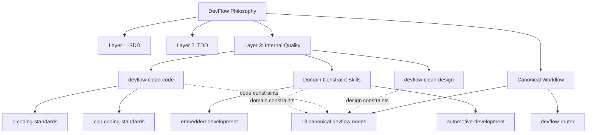

# DevFlow Core Architecture

> 本文定义 DevFlow 从核心理念到可执行 skill 体系的架构映射。任何 skill、command、agent 或平台适配层的修改，都应能回溯到 `docs/devflow-philosophy.md` 的三层质量模型与 human-on-the-loop 协作姿态。

## 1. 架构目标

DevFlow Core 是一个面向 AI coding agent 的通用开发阶段工作流。它的核心不绑定 OpenCode、C、C++、嵌入式或车载领域；这些能力通过独立扩展 skill 或平台适配层进入。

DevFlow Core 负责：

- 把已接受的 AR / DTS / CHANGE work item 推进到规格、设计、TDD 实现、独立评审、完成门禁和收尾。
- 让下一步可从磁盘工件恢复，而不是依赖聊天记忆。
- 保持 author / reviewer / gate / finalizer 角色分离。
- 保留 v1 的 13 个 canonical `devflow-*` runtime nodes 与 `features/<id>/progress.md` 关键字段兼容。

DevFlow Core 不负责：

- 产品发现、发布运维、系统 / 集成 / 验收测试、线上事故管理。
- 具体编程语言的编码规范。
- 具体工程领域的风险维度和证据矩阵。
- 某个 agent runtime 的安装、命令或插件机制。

## 2. 三层质量模型

DevFlow 的实现架构直接映射 `docs/devflow-philosophy.md` 的三层质量模型：

| 层 | 目标 | DevFlow 中的主要承载 |
|---|---|---|
| 第一层 SDD | 意图正确，做对的事 | `devflow-specify`、`devflow-spec-review`、traceability |
| 第二层 TDD | 功能正确，证明做对 | `devflow-ar-design` 的测试设计章节、`devflow-tdd-implementation`、`devflow-test-review` |
| 第三层代码内在质量 | 代码本身设计得好、写得好、值得长期持有 | `devflow-clean-design`、`devflow-clean-code`、`devflow-clean-code` 下的编码规范 skills、领域约束 skills、`devflow-code-review` |

第三层不是新的流程阶段。它是一组质量约束和判断标准，会投射到规格、设计、实现、评审、门禁和收尾中。

## 3. 核心工作流

DevFlow Core 的 runtime topology 继续使用现有 canonical nodes：

```text
devflow-router
devflow-specify
devflow-spec-review
devflow-component-design
devflow-component-design-review
devflow-ar-design
devflow-ar-design-review
devflow-tdd-implementation
devflow-test-review
devflow-code-review
devflow-completion-gate
devflow-finalize
devflow-problem-fix
```

这些节点是 `Current Stage` 与 `Next Action Or Recommended Skill` 的唯一合法 runtime 值。`using-devflow`、编码规范 skills、领域约束 skills、平台适配文档和旧 craft skills 都不能写入 runtime handoff。



## 4. 扩展 Skill 边界

### 4.1 编码规范 Skills

编码规范 skill 属于第三层代码内在质量的语言扩展。它们回答“在这门语言里，什么样的代码才是可维护、可靠、可审查的？”

第一批编码规范 skills：

- `c-coding-standards`
- `cpp-coding-standards`

职责：

- 描述语言级编码规范、工具链、静态分析、格式化和测试约定。
- 为 design / implementation / code-review / completion-gate 提供语言级判断。
- 不承载嵌入式、车载、前端、后端等领域约束。
- 不写 `progress.md`、handoff 或 review verdict。

### 4.2 领域约束 Skills

领域约束 skill 属于第三层代码内在质量的领域扩展。它们回答“在这个工程领域里，什么质量约束必须贯穿规格、设计、实现和验证？”

第一批领域约束 skills：

- `embedded-development`
- `automotive-development`

职责：

- `embedded-development` 声明通用嵌入式风险维度、架构约束、证据要求、术语和模板增补。
- `automotive-development` 声明车载专属约束，如 ASIL、车载 SOA/MDC、DTC、SELinux 和整车生命周期。
- 把领域质量约束前置投射到 `devflow-specify`、设计节点、TDD 实现、test/code review、completion gate、finalize 和 problem-fix。
- 不重复 C / C++ 编码规范。
- 不写 `progress.md`、handoff 或 review verdict。

### 4.3 平台适配层

平台适配层描述某个 runtime 如何发现 skills、调用 subagents、承载 command intent 和读取项目覆盖配置。

当前适配层：

- OpenCode adapter: `docs/guides/opencode-setup.md` 与 `commands/`

未来适配层可以覆盖 Cursor、Claude Code、Gemini、Copilot、Windsurf 或其他 runtime。平台适配层不改变 DevFlow 三层质量模型和 canonical runtime nodes。

## 5. Discovery 与 Routing

`using-devflow` 负责 family-level discovery：

- 识别用户意图属于哪个 DevFlow flow node。
- 识别是否需要编码规范 skill。
- 识别是否需要领域约束 skill。
- 应用跨 DevFlow 的行为宪法和 shared conventions。

`devflow-router` 负责 runtime routing：

- 基于工件证据决定唯一 canonical next node。
- 判定 profile、execution mode、review / gate 恢复路径。
- 消费 review / gate verdict。
- 在路由输出中记录需要叠加的 coding/domain constraints，但不把它们写成 runtime next action。

## 6. v1 兼容策略

保持兼容：

- 13 个 canonical `devflow-*` node 名称。
- `features/<id>/progress.md` 的关键字段。
- `features/<id>/reviews/`、`evidence/`、`completion.md`、`closeout.md` 的工件模型。
- `standard`、`component-impact`、`hotfix`、`lightweight` profile 名称。

重新解释：

- `component-impact` 是现有 v1 profile 名称，可视为 broader architecture-impact 在当前组件仓库语境中的实现。
- 旧 `devflow-*-craft` 不再是第三层主架构。其可复用内容迁入 `devflow-clean-design`、`devflow-clean-code`、编码规范 skills、领域约束 skills 或第二层 TDD / test-review 体系；旧 craft skills 应从仓库中移除，不能作为主动入口或兼容入口。

## 7. 约束原则

- Core flow nodes 只保留通用 workflow 职责：读什么、写什么、何时停止、何时交独立评审。
- 编程语言规则不得留在 core flow node 中作为默认假设。
- 领域风险规则不得留在 core flow node 中作为默认假设。
- 第三层约束可以影响全流程，但不能新增 runtime stage，也不能绕过 review / gate。
- 用户或项目配置可以选择具体 coding/domain skills；未启用的扩展不得阻塞通用 DevFlow 路径。
