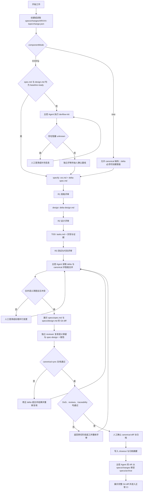

# DevFlow 交付件与归档契约重构方案

## 1. 目标

将 DevFlow 调整为“组件级当前真相 + 完整变更归档”：

- 组件当前规格与设计集中在 `specs/`。
- 活动 AR 与历史归档都位于 `specs/` 下。
- AR 只描述本次增量，归档时由 Agent 将 delta 智能同步到当前文档。
- 既有组件缺少基线文档时，必须先通过 `devflow-init` 从代码逆向建立。
- 保留可测试验收、TDD 证据、独立评审、追溯、DoD 与人工确认。
- 采用 clean break，不兼容或迁移旧 `features/`、`docs/ar-specs/`、`docs/ar-designs/` 布局。

## 2. 目标目录

```text
<component-root>/
└─ specs/
   ├─ spec.md                                # 当前组件规格唯一真相；既有组件必需
   ├─ design.md                              # 当前组件设计唯一真相；既有组件必需
   ├─ changes/
   │  └─ ARXXX-<topic>/
   │     ├─ change.json
   │     ├─ srs.md                           # 本 AR 增量需求
   │     ├─ delta-spec.md                    # 对 specs/spec.md 的增量
   │     ├─ delta-design.md                  # 对 specs/design.md 的增量
   │     ├─ tasks.md
   │     ├─ traceability.md
   │     ├─ reviews/
   │     └─ closeout.md
   └─ archive/
      └─ YYYY-MM-DD-ARXXX-<topic>/            # 完整 change 原样归档
```

## 3. 核心契约

### 3.1 状态与组件模式

- `change.json` 是身份、profile、artifact 图、门禁与归档状态的结构化来源。
- `tasks.md` 只保存任务、TDD 进度和证据，不重复生命周期状态。
- `change.json` 必填 `componentMode: new | existing`。
- `componentMode` 缺失、与仓库现状冲突或无法判断时，必须向人追问，不允许自行推断。

### 3.2 既有组件

`componentMode: existing` 时：

- 开始 specify、design、build 前，`specs/spec.md` 与 `specs/design.md` 必须同时存在且为 `baseline-ready`。
- 任一文档缺失或仍为 draft，立即阻塞后续开发并提示进入 `devflow-init`。
- 仅缺一份文档时，init 只补齐缺失文档，同时与已有文档做一致性核对。

### 3.3 新增组件

`componentMode: new` 时：

- 不执行 `devflow-init`。
- 首次 AR 允许 canonical 文档尚不存在。
- `delta-spec.md` 与 `delta-design.md` 必须能够从空基线生成首版 `specs/spec.md` 与 `specs/design.md`。

### 3.4 增量交付件边界

- `srs.md`：本 AR 的来源、目标、范围、非范围和增量需求。
- `delta-spec.md`：由 SRS 推导出的组件规格增量。
- `delta-design.md`：为满足 delta spec 所需的组件设计增量。
- `tasks.md`：实现任务、RED/GREEN/REFACTOR 进度和证据。
- `traceability.md`：需求条目 → Spec Section → Design Section/Case → Task → Code/Test → Evidence。
- `reviews/`：R1、R2、R3 及 canonical sync 的独立评审记录。
- `closeout.md`：DoD、同步摘要、遗留债务、人工确认和归档路径。

两份 delta 使用稳定 ID 与 `ADDED / MODIFIED / REMOVED / RENAMED` 操作，可表达局部意图。主控 Agent 读取 delta 与当前文档后智能合并，保留未涉及内容，并通过 `change.json` 的 base revision 与 Git diff 识别并行变化。

## 4. devflow-init

新增：

- `skills/devflow-init/SKILL.md`
- `commands/devflow-init.md`
- init 所需的 canonical spec/design 模板、逆向分析清单与 evals

### 4.1 触发条件

- 既有组件缺少 `specs/spec.md`。
- 既有组件缺少 `specs/design.md`。
- canonical 文档仍为 draft 或无法作为 delta 基线。
- 用户明确要求从组件代码逆向初始化规格与设计。

### 4.2 初始化原则

**澄清而不臆造**

- 只读分析源码、测试、公开接口/IDL、配置、构建部署文件与已有说明。
- 不修改业务代码。
- 不把现存实现自动等同于正确需求。
- 每项结论标记为代码/测试可验证事实、人工确认事实或未知。
- 禁止虚构业务意图、设计理由、错误语义、性能阈值和历史决策。
- 证据冲突或信息不足时按阻塞程度分批追问。
- 无法确认的内容保持显式 unknown，不得改写为规范性要求。
- 影响当前契约或架构边界的 unknown 阻塞 `baseline-ready`。

### 4.3 初始化完成条件

- `spec.md` 与 `design.md` 均带代码/测试锚点和 baseline provenance。
- 人工回答已写回对应章节。
- 独立 reviewer 已检查事实来源、推断越界和 spec-design 一致性。
- 人最终确认后，两份文档才标记为 `baseline-ready`。

## 5. Agent 驱动的同步与归档

不新增 `devflow_delivery.py`，不引入候选 hash、专用事务协议或组件仓库运行时脚本。

主控 Agent 采用 OpenSpec OPSX 风格：

1. 读取 `srs.md`、两份 delta 与两份 canonical 文档。
2. 根据稳定 ID 和操作类型智能合并，保留 delta 未涉及内容；有正文变化的 canonical 先进入 draft 并重置评审/确认 metadata。
3. 遇到歧义或 base revision 后的并行变更时先澄清，不猜测覆盖。
4. 展示仅涉及 `specs/spec.md`、`specs/design.md` 的 Git diff。
5. 派发独立 reviewer 检查：
   - delta 是否被完整吸收；
   - 既有语义是否被误删；
   - 是否引入冲突；
   - spec 与 design 是否一致。
6. 未通过则修正 delta 或合并结果并重新复核。
7. 任务、R1/R2/R3、Resolution、traceability、DoD 和 sync 复核全部闭环后，向人展示 canonical diff。
8. 人确认后把实际修改的 canonical 与对应 artifact 恢复为 baseline-ready，写 `closeout.md` 并核验 closeout gate。
9. closeout gate 通过后检查归档目标冲突，将整个 AR 移动到 `specs/archive/YYYY-MM-DD-ARXXX-<topic>/`。
10. 展示完整 Git diff，进入正常 CI。

DevFlow 不沿用 OpenSpec 的宽松归档行为：不允许“警告后继续”，不允许跳过同步，也不允许带未完成任务归档。

Git diff 与 Git 历史承担审计、冲突发现和恢复；不得使用破坏性 reset 处理归档失败。

## 6. 端到端流程



`devflow-reviewer` 只读复核 canonical diff，`devflow-implementer` 不参与同步或归档。运行环境无法读取、编辑或移动文件时流程阻塞，不允许只在聊天中宣称同步或归档完成。

## 7. 实施范围

### 7.1 单一交付契约与恢复模型

- 重写 `skills/using-devflow/SKILL.md` 与 `docs/devflow-core-architecture.md`。
- 增加目录契约、风险 profile、`change.json` 结构和有效示例。
- 所有入口先执行 baseline preflight。
- 删除 active text 中旧 `features/`、promotion、`docs/ar-*` 语义。

### 7.2 阶段技能与模板

- `devflow-specify`：`spec.md` 改为 `srs.md`，增加 `delta-spec-template.md` 和
  `component-spec-template.md`；SRS 将功能性需求、非功能性需求和可验证约束分章。
  组件规格采用“目的 + 当前需求 + 场景”，delta spec 按
  ADDED/MODIFIED/REMOVED/RENAMED 需求分区。
- `devflow-design`：工作项设计改为 `delta-design.md`，canonical 设计为
  `specs/design.md`。`component-design-template.md` 使用原 component design 第
  1–8 章，仅增加 baseline frontmatter 与新路径；原第 9 章质量判断由 review rubric
  承担。`delta-design-template.md` 使用原 AR design 第 1–6、8 章，并把原第 7 章
  替换为 Delta Design 基线、操作、选择器、保留、冲突和同步信息；质量判断由 R2
  reviewer 承担。
- `devflow-tdd`：`plan.md` 改为 `tasks.md`。
- `devflow-review`：适配 SRS、delta、canonical sync 评审。
- `devflow-ship`：promotion 改为 Agent sync + archive。
- `devflow-fix`：适配新目录与交付件命名。
- `devflow-init`：新增既有组件基线初始化流程。

### 7.3 Commands、Agents 与文档

- 新增 `/devflow-init`。
- 更新全部 DevFlow commands 的路径和前置检查。
- 更新 reviewer/implementer 输入输出契约。
- 更新 README、README.zh-CN、INTRODUCTION、核心架构和 OpenCode 指南。

### 7.4 Evals 与仓库检查

- 将 `devflow-init` 加入预期技能集和命令地图。
- 增加 existing/new 判定、禁止臆造、init 路由、局部 delta 智能合并、语义保留、并发澄清、sync 复核和硬归档门禁场景。
- 扩展 `scripts/validate_devflow.py` 与 `tests/test_validate_devflow.py`，校验新 skill/command、模板、引用及旧路径禁用。
- 运行仓库校验、完整 pytest 和全部相关 skill evals。
