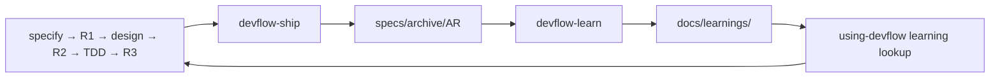

# DevFlow 知识沉淀技能设计

## 1. 设计结论

新增 `devflow-learn` 工具技能，把已完成 DevFlow 交付中值得复用的经验写入仓库知识库。

它借鉴 compound engineering 的捕获、去重、校验和检索闭环，但不照搬会话历史扫描、Rails 专用分类、超长主提示词和自动 Git 操作。

`devflow-learn` 是 Ship 之后的非阻塞反馈环，不是新的生命周期阶段、质量层或 gate。知识捕获失败、用户拒绝捕获，均不影响已经完成的 Ship。

## 2. 为什么不能直接复制 `ce-compound`

参考实现主要从当前对话和历史会话还原问题。DevFlow 已经把更可靠的信息写入磁盘：

- `change.json` 记录身份、profile、gate 和归档状态；
- `tasks.md` 记录调查、RED/GREEN/REFACTOR 和真实执行证据；
- delta、traceability 与 reviews 记录需求、设计、实现和评审链；
- `closeout.md` 记录 DoD、canonical sync 和人工确认；
- `specs/archive/` 保存完整交付历史。

因此 DevFlow 的知识沉淀应以归档工件为主，聊天只用于定位用户想沉淀哪一条经验，不能作为事实来源。

参考实现中的以下部分暂不引入：

- 自动扫描 Cursor、Claude Code、Codex 等本机会话；
- `CONCEPTS.md` 词汇表；
- Full/Lightweight 双模式；
- 自动 commit、branch 或 PR；
- 自动全库 refresh；
- 与具体框架绑定的 component、root cause 枚举。

这些能力会增加隐私风险和维护成本，但不是第一版知识闭环的必要条件。

## 3. 架构位置



知识库放在仓库根目录：

```text
<repo-root>/
└── docs/
    └── learnings/
        ├── README.md
        ├── problem-solutions/
        ├── design-decisions/
        └── engineering-practices/
```

选择仓库级目录而不是组件级目录，便于 monorepo 中跨组件检索。每条 learning 通过 `component` 和 `componentRoot` 标明归属。

知识库不放进 `<component-root>/specs/`。现有 `specs/` 仍是封闭集合：

- `specs/spec.md` 和 `specs/design.md` 保存当前真相；
- `specs/changes/` 保存活动变更；
- `specs/archive/` 保存完成后的审计历史；
- `docs/learnings/` 只保存经过筛选的复用经验。

## 4. 真相优先级

后续 Agent 使用 learning 时按以下顺序判断：

1. 当前 canonical、代码和测试；
2. 已归档 change 的证据；
3. `status: active` 的 learning；
4. 当前或历史聊天。

Learning 可以解释为什么采用某种做法、哪些尝试失败过、什么情况下适用，但不能取代 canonical，也不能把 canonical 内容复制成另一份“当前真相”。

如果 learning 与当前 canonical 或代码冲突，Agent 忽略其指导，报告 stale 信号；不能为了匹配旧 learning 而修改当前代码。

## 5. Skill 入口

技能名：

```text
devflow-learn
```

命令：

```text
/devflow-learn <archive-path-or-AR> [learning hint]
```

建议的 description：

```yaml
description: 在 DevFlow change 已成功归档后，将已验证的缺陷根因、设计取舍或工程实践沉淀为可检索 learning 时使用；也用于用户要求复盘、记录解决方案、避免重复踩坑或建立项目知识库。不用于进行中的问题、未验证方案、普通进度总结或修改 canonical spec/design。
```

参数可以是完整 archive 路径、AR ID，或在来源唯一时省略。不得扫描目录后按“最新文件”猜测来源。

## 6. 捕获资格

每条 learning 必须同时满足：

1. 来源 change 已完成 archive；
2. R1、R2、R3、canonical sync、DoD 和最终人工确认可核；
3. 结论已由测试、评审或当前代码验证；
4. 内容对后续其他 AR 有复用价值；
5. 能引用具体 archive、canonical、代码或测试证据。

以下情况直接跳过：

- 拼写、格式化或机械依赖升级；
- 尚未验证的猜测；
- 只对这一次操作有意义的执行细节；
- 对 canonical 的重复摘要；
- 无法在仓库中安全保存的敏感信息。

没有合格候选是正常结果。技能应输出明确的 no-op 原因，而不是为了“完成沉淀”生成低价值文档。

## 7. 一次只写一条

一个 AR 可能包含多个独立学习点，例如：

- 一个缺陷根因；
- 一个设计取舍；
- 一条测试实践。

一次调用只处理其中一条。若存在多个候选，技能先给出简短候选和证据，由用户选择；其余候选通过后续调用分别处理。

这样可以保持文件主题单一，也便于后续检索、更新和淘汰。

## 8. Learning 类型

### problem-solution

适用于已解决的缺陷或工程问题。正文包括：

- 问题与可观察症状；
- 根因和完整因果链；
- 已尝试但无效的方法；
- 已验证的解决方式；
- 为什么有效；
- 复用条件、非适用范围和预防措施；
- archive、代码和测试证据。

### design-decision

适用于可复用的设计取舍。正文包括：

- 背景和约束；
- 采用的方案；
- 被否决的备选方案；
- 选择理由和代价；
- 适用边界；
- 对未来设计的提示；
- delta design、canonical 和 review 证据。

### engineering-practice

适用于测试、工具和开发流程经验。正文包括：

- 触发这条实践的问题；
- 建议做法；
- 为什么这样做；
- 示例；
- 不适用场景；
- 验证证据。

第一版只保留这三类，具体技术主题使用 `tags`，避免建立十几个容易漂移的目录分类。

## 9. Frontmatter 契约

```yaml
---
schemaVersion: "1.0"
documentType: devflow-learning
learningId: notifications-problem-solution-timeout-retry
learningType: problem-solution
component: notifications
componentRoot: components/notifications
status: active
sensitivity: internal
capturedAt: 2026-08-11
lastVerifiedAt: 2026-08-11
sourceChanges:
  - AR042-timeout
sourceArchives:
  - components/notifications/specs/archive/2026-08-11-AR042-timeout
tags:
  - timeout
  - retry
canonicalRefs:
  - SPEC-FR-014
  - DEC-003
---
```

字段规则：

- `learningId` 使用稳定 kebab-case，并与文件名一致；
- `learningType` 只允许三种类型；
- `componentRoot` 和 `sourceArchives` 使用仓库相对路径；
- `status` 只允许 `active`、`stale`、`superseded`；
- `sensitivity` 只允许 `public`、`internal`、`restricted`；
- `restricted` 内容禁止写入仓库知识库；
- `sourceArchives` 必须指向真实且状态为 archived 的 change；
- `canonicalRefs` 可选，只写真实存在的稳定 ID；
- 文件名不带日期；日期由 frontmatter 保存。

机器契约存放在 skill 自身的 `references/learning-schema.json`，不能只把字段规则写在提示词里。

## 10. 捕获流程

### 10.1 定位与预检

1. 解析 repo root、目标组件和 archive。
2. 读取归档后的 `change.json`、`closeout.md` 和 gate 证据。
3. 确认 archive 完整且人工确认存在。
4. 不满足条件时停止，并指出需要返回 `devflow-ship` 的具体缺口。

### 10.2 提取候选

按 learning 类型读取相关材料：

- problem-solution：优先看 `tasks.md` 的复现、根因、排除假设和 TDD 证据；
- design-decision：优先看 `delta-design.md` 的 Design Options、决策和 R2；
- engineering-practice：优先看 reviews、Resolution、工具或流程改进证据。

候选要能用一句话说清复用价值。说不清时不捕获。

### 10.3 去重

先按以下字段过滤已有文档：

- `learningId`
- `component`
- `componentRoot`
- `learningType`
- `tags`
- `sourceChanges`

再从五个维度判断语义重叠：

1. 问题或决策是否相同；
2. 根因或选择理由是否相同；
3. 方案或指导是否相同；
4. 代码、测试或 canonical 锚点是否相同；
5. 适用边界是否相同。

处理规则：

- 高重叠：更新原文件，追加新来源并更新 `lastVerifiedAt`；
- 中度重叠：新建文件并交叉引用；
- 低重叠：正常新建。

第一版不生成 `index.json`。固定目录、frontmatter 和文本搜索已经足够，也不会引入需要同步维护的第二真相。

### 10.4 写入与评审

主控 Agent 负责最终写入。研究或评审子代理只读，不得修改 learning、archive、canonical 或 `change.json`。

写入前执行两层检查：

1. 确定性脚本检查 schema、路径、链接、占位符、唯一性和敏感信息；
2. 全新只读上下文按 rubric 核对事实、复用价值、重复和时效性。

平台不支持独立上下文时，可以执行主控自检，但必须说明失去的独立检查覆盖，不能把同一上下文的两个视角算作独立评审。

## 11. 隐私和敏感信息

默认只读取仓库内已归档 DevFlow 工件和当前代码。第一版不读取本机会话历史。

写入前必须移除或阻断：

- 私钥、JWT、云密钥、连接串、认证头和 token；
- 真实客户标识、个人邮箱、姓名等 PII；
- 内部 URL、机器用户名和绝对路径；
- 大段原始日志、请求或响应正文；
- 不能进入当前仓库可见范围的信息。

错误信息只保留定位问题所需的最小签名。敏感扫描必须有确定性测试，不能完全依赖模型判断。

## 12. 与现有技能的衔接

### devflow-ship

成功归档后执行一次只读候选判断：

- 机械变更或无复用价值时静默跳过；
- 有明确候选时，attended 模式向用户提出一次捕获建议；
- unattended 模式只输出候选报告，不自动写文件。

候选判断和知识写入都在 Ship 完成之后。任何结果都不能回写 gate 或改变 archive 成功状态。

### using-devflow

解析组件和工作主题后，增加非门禁的 learning lookup：

1. 搜索 `docs/learnings/` 中 `status: active` 的文档；
2. 先按 component、componentRoot、tags、错误签名和 canonicalRefs 缩小范围；
3. 只读取强相关候选；
4. 把命中结果作为补充上下文；
5. 与当前 canonical 或代码冲突时，以当前真相为准并报告 stale 信号。

这样新会话不需要知道 `devflow-learn` 的存在，也能复用已有知识。

## 13. Skill 包结构

```text
skills/devflow-learn/
├── SKILL.md
├── references/
│   ├── learning-contract.md
│   ├── learning-schema.json
│   ├── learning-templates.md
│   └── learning-review-rubric.md
├── scripts/
│   └── validate_learning.py
└── evals/
    └── evals.json

commands/
└── devflow-learn.md
```

`SKILL.md` 控制在约 400 行内。模板、schema 和 rubric 按执行阶段读取。Skill 必须自包含，不能反向引用仓库级 `docs/` 设计文件。

## 14. 仓库改动

新增：

- `skills/devflow-learn/SKILL.md`
- `skills/devflow-learn/references/learning-contract.md`
- `skills/devflow-learn/references/learning-schema.json`
- `skills/devflow-learn/references/learning-templates.md`
- `skills/devflow-learn/references/learning-review-rubric.md`
- `skills/devflow-learn/scripts/validate_learning.py`
- `skills/devflow-learn/evals/evals.json`
- `commands/devflow-learn.md`

修改：

- `skills/devflow-ship/SKILL.md`
- `skills/using-devflow/SKILL.md`
- `scripts/validate_devflow.py`
- `tests/test_validate_devflow.py`
- 新增或拆分 learning validator 测试
- `commands/README.md`
- `README.md`
- `README.zh-CN.md`
- `INTRODUCTION.md`
- `CONTRIBUTING.md`
- `CHANGELOG.md`
- `docs/devflow-core-architecture.md`

## 15. 验证场景

Evals 至少覆盖：

- 未归档 change 拒绝捕获；
- 无复用价值时 no-op；
- 一次只生成一条 learning；
- 不复制 canonical 当前真相；
- 高重叠更新原文而不是新建重复文件；
- 与当前代码冲突时当前真相优先；
- token、PII、内部路径和日志得到阻断或脱敏；
- 不修改 gate、archive 或 canonical；
- unattended 只报告候选；
- lookup 只使用 `status: active` 的相关文档。

仓库验证命令：

```bash
python scripts/validate_devflow.py
python -m pytest tests/
```

## 16. 后续能力

当知识数量和实际漂移问题证明有需要时，再独立设计 `devflow-learn-refresh`：

- 扫描 stale、重叠和被替代的 learning；
- 产生 Keep、Update、Consolidate、Replace、Delete 建议；
- 只读审计与实际修改分开授权；
- apply、commit 和 PR 不与审计默认绑定。

在此之前，`status` 和 `lastVerifiedAt` 已为维护流程预留必要信息。
