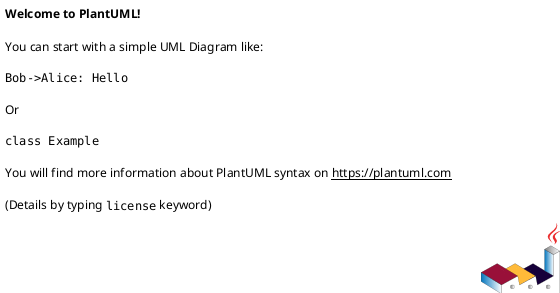

# AR 实现设计增量说明书

使用说明：

- 本模板用于 `devflow-design` 产出 `<component-root>/specs/changes/ARXXX-<topic>/delta-design.md`。`devflow-ship` 经独立复核和人工确认后，将本增量同步到 `specs/design.md`，并随完整变更（`change`）归档。
- 正式交付件必须删除模板说明、示例业务内容和任何占位符；不得残留 `AI提示`、`TBD`、`{DATE}`、变量替换规则等模板痕迹。
- 测试设计必须是本文档章节，不得拆成独立 `test-design.md`。
- 文档结构包括 AR 概述、动态行为、功能点分解、实现设计、适用领域场景设计、重构设计、测试设计、差量设计信息和模板修订记录。第 7 章记录基线、操作、选择器、保留条款、冲突与同步约束。
- MDC / SELinux、实时性、资源受限、前后端集成等领域内容只在命中对应领域技能的说明字段（`description`）时填写；未命中的领域写明 N/A 与判定依据。设计质量由 R2 评审者按评审准则独立检查。

## 1. AR 概述（必要）

描述 AR 的基本信息，包括组件名称和命名。

| 字段 | 内容 |
|---|---|
| 工作项 ID |  |
| AR 系统流水号 |  |
| AR 描述 |  |
| 所属组件 |  |
| 关联 IR / SR |  |
| 所有者（`Owner`）/ 开发负责人 |  |
| 组件基线 | `specs/design.md` 章节路径 / 实体键 / 修订锚点；新组件写 `EMPTY` |

## 2. 动态行为（必要）

### 2.1 交互时序图

使用 PlantUML 描述本 AR 涉及的内部模块、外部服务、SDK、硬件或协议栈交互。参与者应使用真实组件 / 类 / 服务名，消息应体现接口或方法调用。

```plantuml
@startuml
autonumber
' TODO: 替换为真实参与者和调用
@enduml
```

## 3. 功能点分解（必要）

针对本需求详细分解具体功能点，以便开发和测试对功能细节对齐。此部分应由开发、测试共同参与需求澄清后输出，作为双方统一认识的载体。测试用例以覆盖此处功能点为目标进行设计。功能性需求回指 Acceptance，NFR 回指 QAS/Response Measure，CON 回指 Verification，并能被第 6 章测试设计覆盖。

| 序号 | 功能点 ID | 覆盖需求 | 功能点名称 | 功能点描述 | 优先级 | 可独立测试 |
|---|---|---|---|---|---|---|
| 1 |  |  |  |  | 高（`high`）/ 中（`medium`）/ 低（`low`） | 是 / 否 |

## 4. 实现设计（必要）

### 4.0 方案选择（`Design Options`，必要）

在写完整实现设计前记录候选方案、取舍（`trade-off`）、推荐项和确认状态。若只有一个显然方案，写“单一明显方案”（`Single obvious option`）并说明为什么不展开多方案。

| 方案 | 改动范围 | 控制流 / 数据结构要点 | 测试策略 | 风险 | 成本 / 取舍 | 结论 |
|---|---|---|---|---|---|---|
| A |  |  |  |  |  | 推荐（`recommended`）/ 否决（`rejected`） |
| B |  |  |  |  |  | 推荐（`recommended`）/ 否决（`rejected`） |

- 推荐方案：
- 选择理由：
- 确认负责人：开发负责人 / 模块架构师
- 确认状态：已确认（`confirmed`）/ 待确认（`pending`）/ N/A（单一明显方案）

### 4.1 功能实现思路（必要）

描述清楚从规格到代码的实现思路，体现需求相关人（业务分析师（`BA`）、开发、测试等）对系统实现诉求和理解一致，能够支持后续评估开发工作量。至少覆盖：

- 代码重构需求分析
- 新增 / 修改类清单
- 业务流程与异常流程
- 现有功能影响评估
- 代码移植说明（如有）
- 与 `specs/design.md` 组件设计基线的一致性和增量关系说明

### 4.2 功能实现设计（必要）

本章节写设计与实现的具体内容；对于流程编排必须提供流程图、时序图等。若需求涉及大量用户交互或业务流程，需要针对场景汇总说明。

#### 4.2.1 用例图（如有）



#### 4.2.2 流程图


#### 4.2.3 流程说明

**正常流程**：

1.

**异常流程**：

1.

### 4.3 数据库及文件持久化设计（可选）

如果涉及数据库操作，本章节写数据模型设计说明，包含表结构变化、字段说明、原表数据量级、数据割接逻辑、回退逻辑等。其他文件操作（如 sharepf、配置文件、持久化文件）也需说明。若有数据割接，必须说明割接和回滚逻辑。

#### 4.3.1 表结构设计

| 表 / 文件 | 变更内容 | 数据量级 | 割接逻辑 | 回滚逻辑 |
|---|---|---|---|---|
|  |  |  |  |  |

#### 4.3.2 字段说明

| 字段名 | 类型 | 主键 | 可空 | 描述 |
|---|---|---|---|---|
|  |  | 是 / 否 | 是 / 否 |  |

#### 4.3.3 数据割接（如有）

- 割接逻辑:
- 回滚逻辑:

### 4.4 接口描述（必要）

按照 AR 上下文关系图，描述与服务器、第三方 SDK、内部模块 / 服务 / 组件的新增或修改接口。涉及服务器接口时，说明关键变更点并引用接口定义地址；涉及第三方 SDK 时，引用具体 SDK 接口文档地址；内部接口在本章节直接描述。接口变更必须基于 `specs/design.md` 增量说明，不得在 AR 中重新定义组件级架构。

| 序号 | 接口名 | 所属方 | 描述 | 参数 | 返回值 / 错误码 | 并发约束 | 兼容性影响 |
|---|---|---|---|---|---|---|---|
| 1 |  |  |  |  |  |  |  |

### 4.5 GUI 界面（可选）

涉及 UI / HMI / 配置界面时必须输出，结合高保真模型或界面原型说明；不涉及 UI 时写明“不涉及”及理由。

### 4.6 代码设计（必要）

针对 AR 上下文中的框图对代码层级做设计，重点说明模块化 / 组件化涉及的要点。如果涉及多仓，需要全部列举；涉及 MVP 的需提前思考并向 MVP 靠拢。

#### 4.6.1 包 / 目录结构设计

| 包 / 目录路径 | 描述 | 包含类 / 文件 | 变更类型 |
|---|---|---|---|
|  |  |  | 新增 / 修改 / 删除 |

#### 4.6.2 类设计

| 类名 | 文件路径 | 职责 | 公开 API | 变更类型 |
|---|---|---|---|---|
|  |  |  |  |  |

#### 4.6.3 类图


### 4.7 适用领域场景设计（按领域约束启用）

默认的 DevFlow 核心（`DevFlow Core`）不强制任何具体领域场景。若工作项（`work item`）命中某个领域开发技能的说明字段（`description`），则按该技能的风险维度填写本节；未命中的领域写 N/A。回答“不涉及”时必须给出判定依据。

#### 4.7.1 并发场景分析

针对代码中涉及的并发场景进行分析和设计（线程和数据保护），并考虑未来支持并发的可能性。

| 分析项 | 内容 |
|---|---|
| 是否涉及并发 | 是 / 否 |
| 判定依据 |  |
| 并发场景描述 |  |
| 线程 / 中断 / 任务模型 |  |
| 线程保护机制 |  |

#### 4.7.2 启动退出分析

针对需求代码中涉及功能，分析对进程启动和退出的影响，并针对场景给出设计和处理。

| 分析项 | 内容 |
|---|---|
| 是否涉及启动 / 退出 | 是 / 否 |
| 判定依据 |  |
| 影响评估 |  |
| 处理策略 |  |

#### 4.7.3 休眠唤醒分析

针对需求代码中涉及功能，分析对休眠唤醒场景下的影响，并针对场景给出设计和处理。

| 分析项 | 内容 |
|---|---|
| 是否涉及休眠唤醒 | 是 / 否 |
| 判定依据 |  |
| 影响评估 |  |
| 处理策略 |  |

#### 4.7.4 可靠性分析

重点针对与周边模块（包括硬件）交互的可靠性设计，如启动时序、依赖关系、断链、超时、部分失败等。

| 分析项 | 内容 |
|---|---|
| 可靠性要求 |  |
| 外部依赖 / 硬件交互 |  |
| 断链 / 超时 / 部分失败处理 |  |
| 降级 / 重试 / 告警策略 |  |

#### 4.7.5 进程 SELinux 权限分析

明确本进程究竟需要触碰系统的哪些部分，并给出主体对象、客体对象、主客体访问关系及其 SELinux 规则基线。

| 分析项 | 内容 |
|---|---|
| 是否涉及权限变化 | 是 / 否 |
| 判定依据 |  |
| 主体对象 | 进程 / 服务 / 可执行文件 / 线程上下文等发起访问的一方 |
| 主体标签基线值 | 当前 SELinux 域（`domain`）/ 类型（`type`）/ 上下文（`context`），例如 `<subject_domain>`；注明来源（现网策略、基线版本、审计日志、源码配置等） |
| 客体对象 | 文件 / 目录 / 设备节点 / 套接字（`socket`）/ Binder（`binder`）/ 属性（`property`）/ IPC / 系统资源等被访问的一方 |
| 客体标签基线值 | 当前 SELinux 类型（`type`）/ 上下文（`context`），例如 `<object_type>`；注明来源（`file_contexts`、`property_contexts`、策略文件、审计日志等） |
| 主客体访问关系 | `<主体对象>` 对 `<客体对象>` 的访问动作，例如读（`read`）/ 写（`write`）/ 获取属性（`getattr`）/ 打开（`open`）/ 设备控制（`ioctl`）/ 连接（`connectto`）/ 调用（`call`）/ 设置（`set`） |
| 规则基线值 | 当前允许（`allow`）/ 永不允许（`neverallow`）/ 不审计（`dontaudit`）/ 类型转换（`type_transition`）等策略规则基线；说明是否已有规则、是否需新增 / 修改 / 删除 |
| 权限变化说明 | 本 AR 是否改变主体、客体、标签或访问动作；若不变化，说明沿用基线的理由 |
| 权限申请与风险 | 新增或放宽规则的必要性、最小权限证明、误授权风险、回退策略 |

## 5. 重构设计（可选）

如本 AR 需要重构，必须说明触发原因、范围、受影响模块和验证方式；跨组件边界的结构性重构必须通过本文件第 7 章的差量操作（`delta operation`）修改 `specs/design.md`，并经 R2 与模块架构师确认。

| 重构项 | 描述 | 影响模块 | 验证方式 | 是否触发升级 |
|---|---|---|---|---|
|  |  |  |  | 是 / 否 |

## 6. 测试设计（必要）

对接口、算法、关键功能进行测试策略和测试场景设计，同时对可测试性需求进行设计。测试设计驱动后续 `devflow-tdd` 的逐用例实现。每个用例必须回指功能点、需求条目，以及对应的 FR/IFR Acceptance、NFR 完整 QAS 或 CON Verification；写不出用例或验证的需求 = 规格不可测试，回 `devflow-specify`。

**规范规则（`Canonical`）**：第 6.1「测试点汇总」是 TDD 的唯一用例索引，用例标识（`Case ID`）必须使用稳定的 `TC-xxx`。第 6.2-6.6 只能展开第 6.1 中已存在的用例标识（`Case ID`），不得新增无法回指第 6.1 的用例。

### 6.1 测试点汇总

| 用例标识（`Case ID`） | 覆盖需求 | Acceptance / QAS / Verification 锚点 | 前提 / 操作 / 结果摘要（`Given/When/Then`） | 预期结果 | 覆盖功能点 | 测试层级（`Test Level`） | 覆盖类型（`Coverage Type`） | 测试因子 | 组合方式 | 逻辑覆盖程度 |
|---|---|---|---|---|---|---|---|---|---|---|
| TC-001 |  |  |  |  |  | 单元（`unit`）/ 集成（`integration`）/ 仿真（`simulation`） | 正常（`happy`）/ 边界（`boundary`）/ 异常（`exception`）/ 适用风险（`applicable-risk`） |  | 成对组合（`Pairwise`）/ 全遍历 / 指定组合 | 语句 / 判定 / 路径 |

**测试因子组合说明**：

- 成对组合（`Pairwise`）覆盖：将所有测试因子的取值两两组合，保证任意 2 个因子的所有取值组合至少被覆盖一次，可达到约 80% 逻辑覆盖。
- 全遍历组合：所有测试因子取值的全面组合。

**逻辑覆盖程度说明**：

- 语句覆盖：设计若干测试用例，运行被测程序，使每一可执行语句至少执行一次。
- 判定覆盖：也叫分支覆盖，使程序中每个判断的取真分支和取假分支至少执行一次。
- 路径覆盖：设计足够多的测试用例，覆盖程序中所有可能路径。

### 6.2 单元测试（UT）

单元测试主要覆盖哪些功能点。

| 用例 ID | 功能点 | 前置条件 | 步骤 / 触发 | 预期结果 | 模拟对象（`Mock`）/ 测试桩（`Stub`）/ 仿真 | 预期验证命令（非证据） |
|---|---|---|---|---|---|---|
|  |  |  |  |  |  |  |

### 6.3 接口测试

接口测试必须按照接口说明来测试，包括必选字段、可选字段、字段长度、错误码等校验。

| 用例 ID | 接口名 | 测试类型 | 测试内容 | 预期结果 |
|---|---|---|---|---|
|  |  | 必选字段 / 可选字段 / 字段长度 / 错误码 |  |  |

### 6.4 业务场景测试

描述涉及的业务 / 功能场景。

| 用例 ID | 场景 | 测试步骤 | 预期结果 |
|---|---|---|---|
|  |  |  |  |

### 6.5 异常场景测试

描述异常场景下的可靠性测试，包括交互部件之间的断链 / 超时、批处理消息全部失败 / 部分失败 / 全部成功等。

| 用例 ID | 场景 | 处理方式 | 预期结果 |
|---|---|---|---|
|  |  |  |  |

### 6.6 适用风险覆盖矩阵

| 适用风险维度 | 覆盖该维度的用例标识（`Case ID`） | 说明 |
|---|---|---|
| 内存（边界、池化、栈溢出） |  |  |
| 并发（中断上下文、临界区、竞态） |  |  |
| 实时性（截止时间、调度、节拍） |  |  |
| 资源生命周期（句柄、文件、缓冲区） |  |  |
| 错误处理（输入校验、降级、恢复） |  |  |
| ABI / API 兼容（跨版本、跨平台） |  |  |

### 6.7 测试用例设计脑图（可选）


## 7. 差量设计（`Delta Design`）信息（必要）

> 第 1–6 章描述设计内容，本章说明这些内容如何相对 `specs/design.md` 定位、
> 修改、保留和复核。质量判断由 R2 评审者（`reviewer`）按评审准则（`rubric`）执行。

### 7.1 基线与来源

- 变更清单：`change.json`（组件模式与变更基线的唯一来源）
- 组件设计：`specs/design.md@<baselineRevision / contentDigest> | EMPTY`
- 差量规格（`Delta spec`）：`delta-spec.md@<修订或摘要>`
- 权威规格（`Canonical spec`）：`specs/spec.md@<修订或摘要> | EMPTY`
- 允许修改的组件模板章节：
- 冲突规则：基线（`base`）之后目标章节或实体行发生重叠变化时停止并澄清，不覆盖较新内容。
- 保留规则：未被操作（`operation`）精确指向的章节、表格行、接口字段、测试项和正文语义保持不变。

### 7.2 影响映射与操作摘要

| 需求条目 | 规格操作 / 章节（`Spec operation / Section`） | AR 设计章节 | 组件设计章节 / 实体键 | 决策 | 用例 |
|---|---|---|---|---|---|
| FR-001 | DS-001 / SPEC-FR-001 | 4.2 / 6.1 | 6.2.1 / FUNC.001 | DEC-001 | TC-001 |

| 操作标识（`Operation ID`） | 类型 | 目标章节 / 实体键 | 选择器（`Selector`） | 需求条目 / 规格来源 |
|---|---|---|---|---|
| DD-001 | ADDED / MODIFIED / REMOVED / RENAMED | 6.2 / FUNC.001 |  | FR-... / DS-... |

### 7.3 设计操作（`Design Operations`）

#### DD-001 [ADDED] 6.2 功能列表详设 / FUNC.002

- 需求条目 / 规格来源：
- 父章节：`6.2 功能列表详设`
- 实体键：`FUNC.002`
- 插入位置：
- 对应本文章节：`<1–6 章锚点>`
- 完整新增内容：<符合 `component-design-template.md` 对应章节结构>
- 决策 / 用例：`DEC-...` / `TC-...`

#### DD-002 [MODIFIED] 6.1.3 对外 API 接口 / <API 名>

- 需求条目 / 规格来源：
- 选择器（`Selector`）：`<API 名>.<参数 / 返回值 / 错误码 / 并发约束 / 兼容性策略>`
- 基线（`Base`）摘录或摘要：
- 替换（`Replace`）：<被替换的精确现行语义>
- 替换为（`With`）：<批准的新语义>
- 合并后的局部内容（`Resulting local content`）：<合并后的完整局部内容>
- 保留条款（`Preservation clause`）：保留目标 API 未列出的字段和所有同级行 / 章节（`sibling rows/sections`）。
- 回归用例（`Regression Cases`）：`TC-...`

#### DD-003 [REMOVED] 6.3 软件单元设计 / <软件单元名>

- 需求条目 / 规格来源：
- 选择器（`Selector`）：`6.3.<软件单元名>` + 基线（`base`）摘要
- 被删除的精确语义（`Exact semantics removed`）：
- 依赖方 / 调用方（`Dependents / callers`）：
- 资源清理顺序（`Resource cleanup order`）：
- 迁移 / 兼容性（`Migration / compatibility`）：
- 删除后的架构（`Resulting architecture`）：
- 保留条款（`Preservation clause`）：

#### DD-004 [RENAMED] 6.3 软件单元设计 / <软件单元名>

- 需求条目 / 规格来源：
- 实体键（`Entity key`）：`<原软件单元名>` + 基线（`base`）摘要
- 原名称（`From`）：
- 新名称（`To`）：
- 正文变化（`Body changes`）：无（`none`）
- 引用更新范围（`Reference update scope`）：
- 保留条款（`Preservation clause`）：正文、契约和测试语义不变。

### 7.4 N/A 与风险档位

行为与组件设计均不变化时可写：

- 差量设计（`Delta design`）：`N/A`
- 权威目标（`Canonical target`）：`specs/design.md#<章节 / 实体键>`
- 不变证据：
- 保留条款（`Preservation clause`）：`specs/design.md` 全部语义保持不变。
- 回归用例（`Regression Cases`）：

N/A 仍需 R2、R3 和权威同步评审（`canonical sync review`）。根据 `change.json.profile` 列出适用维度：

| 风险维度 | 是否适用 | 本文设计章节 / 用例 / N/A 证据 |
|---|---|---|
| 接口兼容 / 数据迁移 / 并发 / 实时 / 资源 / 安全 / 功能安全 / 多组件 / UI | 是 / 否 |  |

## 8. 模板修订记录

| 日期 | 修订版本 | 描述 | 作者 |
|---|---|---|---|
|  |  |  |  |
